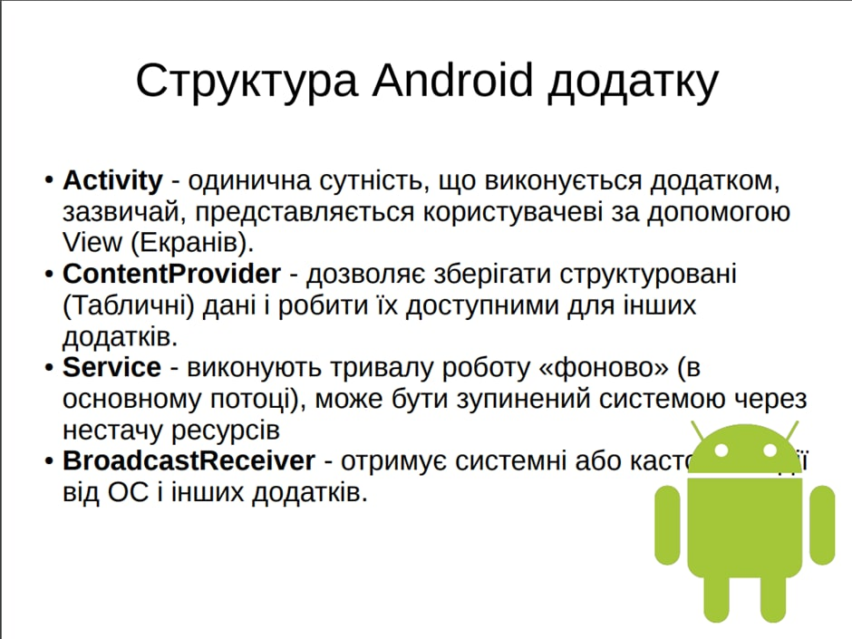

# Для чого використовують логування? Як записати в лог довільне повідомлення? Наведіть приклад коду.

Логування – це форма автоматичного запису повідомлень у хронологічному порядку. Зазвичай логування використовують для журналювання подій які відбуваються у системі. У тому числі виключень і помилок. Таким чином, використання логування необхідне для виявлення проблем які можуть виникати та встановлення причин їх виникнення. Також логування можна використовувати під час відладки. У Android SDK входить досить великий набір інструментів для відладки, проте один з найважливіших – це LogCat.
Клас android.util.Log представляє собою логгер та дозволяє розбивати повідомлення на категорії в халежності від їх важливості:

- Log.e() - помилки (error)
- Log.w() - попередження (warning)
- Log.i() - інформація (info)
- Log.d() - відладка (degub)
- Log.v() - подробиці (verbose)

У першому параметрі методі приймається спеціальна строка, що називається тегом:

```java
private static final String TAG = this.getClass().getSimpleName();
```

Далі у будь-якому місці коду ми можемо викликати метод логеру. Для прикладу залогуємо довільне повідомлення:

```java
Log.i(TAG, "Довільне повідомлення");
```

Мабуть головним призначенням логування є повідомлення при виникнення виключних ситуацій:

```java
try {
// ...
} catch (Exception exception) {
Log.e(TAG, "Отримано виключення", exception);
}
```

Корисні посилання:

- https://dimlix.com/logs-in-android-development/
- http://developer.alexanderklimov.ru/android/debug/logcat.php

# Для чого використовуються об’єкти Іntеnt? Наведіть приклад застосування.

Об'єкт Intent містить інформацію, що цікава для компонента, який отримує намір, і дані, які передаються цьому компоненту. Крім того, об'єкт Intent містить інформацію, цікаву для системи Android, ім'я компонента, який має намір обробити і набір параметрів запуску цього компонента.

Приклад:

```java
Intent intent = new Intent(this, SecondActivity.class);
startActivity(intent);
```

# Для чого призначені сервіси та в чому їх відмінність від Асtіvіty? Наведіть приклад застосування.

Activity – це графічний інтерфейс, а сервіс – це потік, що не відноситься до графічного інтерфейсу, який може працювати у фоновому режимі.

```java
public class MyService extends Service {
final String LOG_TAG = "myLogs";

  public void onCreate() {
    super.onCreate();
    Log.d(LOG_TAG, "onCreate");
  }

 public void onDestroy() {
    super.onDestroy();
    Log.d(LOG_TAG, "onDestroy");
  }
}
```

# Зобразіть у вигляді діаграми життєвий цикл Activity в Android. Опишіть його.


- **onCreate()** - перший метод, з якого починається виконання діяльності. У цьому методі діяльність переходить у стан Created. Цей метод обов'язково має бути визначений у класі діяльності. У ньому проводиться початкове настроювання діяльності. Зокрема, створюються об'єкти візуального інтерфейсу. Цей метод отримує об'єкт Bundle, який містить колишній стан діяльності, якщо він був збережений. Якщо активність заново створюється, цей об'єкт має значення null. Якщо ж activity вже раніше була створена, але перебувала у зупиненому стані, то bundle містить пов'язану з activity інформацію. Після того, як метод onCreate() завершив виконання, activity переходить у стан Started, і система викликає метод onStart().
- **onStart** У методі onStart() здійснюється підготовка до виведення діяльності на екран пристрою. Як правило, цей метод не вимагає перевизначення, а всю роботу здійснює вбудований код. Після завершення роботи методу activity відображається на екрані, викликається метод onResume, а activity переходить у стан Resumed.
- **onResume** При викликі методу onResume activity переходить у стан Resumed і відображається на екрані пристрою, і користувач може з нею взаємодіяти. І власне activity залишається в цьому стані, поки вона не втратить фокус, наприклад, внаслідок перемикання на іншу activity або просто через вимкнення екрана пристрою.
- **onPause** Якщо користувач вирішить перейти до іншої діяльності, то система викликає метод onPause, а activity переходить у стан Paused. У цьому методі можна звільняти використовувані ресурси, призупиняти процеси, наприклад, відтворення аудіо, анімацій, зупиняти роботу камери (якщо вона використовується) і т.д., щоб вони менше впливали на продуктивність системи. Але треба враховувати, що в цьому стані activity як і раніше залишається видимою на екрані, і на роботу даного методу відводиться дуже мало часу, тому не варто тут зберігати якісь дані, особливо якщо при цьому потрібне звернення до мережі, наприклад, надсилання даних Інтернету, або звернення до бази даних - подібні дії краще виконувати методом onStop(). Після виконання цього методу діяльність стає невидимою, не відображається на екрані, але вона все ще активна. І якщо користувач вирішить повернутися до цієї activity, то система знову викличе метод onResume, і activity знову з'явиться на екрані. Інший варіант роботи може виникнути, якщо раптом система бачить, що для роботи активних програм необхідно більше пам'яті. І система може сама повністю завершити роботу діяльності, яка невидима і знаходиться в фоні. Або користувач може натиснути кнопку Back (Назад). У цьому випадку у діяльності викликається метод onStop.
- **onStop** У цьому методі діяльність переходить у стан Stopped. У цьому стані діяльність повністю невидима. У методі onStop слід особливо чекати використовувані ресурси, які не потрібні користувачеві, коли він не взаємодіє з діяльністю. Тут також можна зберігати дані, наприклад, базу даних. При цьому під час стану Stopped activity залишається в пам'яті пристрою, зберігається всі елементи інтерфейсу. Наприклад, якщо в текстове поле EditText було введено якийсь текст, то після відновлення роботи activity та переходу її в стан Resumed ми знову побачимо в текстовому полі раніше введений текст. Якщо після виклику методу onStop користувач вирішить повернутися до попередньої діяльності, тоді система викличе метод onRestart. Якщо ж діяльність зовсім завершила свою роботу, наприклад, через закриття програми, то викликається метод onDestroy().
- **onDestroy** Ну і завершується робота activity викликом методу onDestroy, який виникає або, якщо система вирішить убити activity в силу конфігураційних причин (наприклад, поворот екрана або при багатокінному режимі), або при виклик методу finish(). Також слід зазначити, що при зміні орієнтації екрана система завершує діяльність і потім створює її заново, викликаючи метод onCreate.

# Зобразіть у вигляді діаграми життєвий цикл AsyncTask в Android


Об'єкт AsyncTask повинен бути створений в UI-потоці

- метод execute повинен бути викликаний в UI-потоці
- не викликайте безпосередньо методи `onPreExecute`, `doInBackground`, `onPostExecute`, `onProgressUpdate`
- `AsyncTask` може бути запущений (`execute`) тільки один раз, інакше виникне exception
- `execute` - цей метод ми викликаємо явно, щоб почати виконання завдання.
- `onPreExecute` і `onPostExecute` - їх ми самі явно не викликаємо, вони викликаються системою на початку і у кінці виконання завдання.
- `doInBackground` - в ньому ми вказуємо, що нам треба виконати у новому потоці. На вхід надходять дані, які ми передали в `execute`. Явно не викликаємо.
- `publishProgress` - явно викликаємо в методах `doInBackground`, `onPreExecute` або `onPostExecute`. На вхід передаємо проміжні дані.
- `onProgressUpdate` - метод отримує на вхід проміжні результати. Самі не викликаємо, замість цього використовуємо метод `publishProgress`. Те, що передаємо у `publishProgress`, потрапляє в `onProgressUpdate`.

# Зобразіть у вигляді діаграми життєвий цикл SERVICE в Android?

Cлужба може працювати обома способами - вона може бути запущеною (і працювати протягом необмеженого часу) і допускати прив'язку.
Це залежить від реалізації методів зворотного виклику:

- `onStartCommand()` дозволяє компонентам запускати службу
- `onBind()` дозволяє виконувати прив'язку.

# Коли в Асtіvіty в Аndrоіd викликається метод оnРаusе()? Опишіть призначення цього методу. Наведіть приклад коду.

Система викликає цей метод як першу вказівку на те, що користувач залишає вашу активність (хоча це не завжди означає, що активність знищується); це вказує на те, що активність більше не знаходиться на передньому плані (хоча вона все ще може бути помітна, якщо користувач знаходиться в багатовіконному режимі). Використовуйте цей `onPause()` метод, щоб призупинити або налаштувати операції, які не повинні продовжуватися (або повинні продовжуватися помірно), поки Activity об'єкт перебуває в стані «Припинено», і які ви очікуєте відновити найближчим часом. Існує кілька причин, через які активність може увійти до цього стану.
Наприклад:
Деяка подія перериває виконання програми, як описано в розділі `onResume()`. Це найпоширеніший випадок.
В Android 7.0 (рівень API 24) або вище кілька програм працюють у багатовіконному режимі. Оскільки тільки один із додатків (вікна) має фокус у будь-який момент часу, система зупиняє роботу решти всіх додатків.
Відкриється нова напівпрозора дія (наприклад, діалог). Поки дія все ще частково видно, але не у фокусі, вона залишається зупиненою.
Коли дія перетворюється на стан паузи, будь-який компонент, що підтримує життєвий цикл, пов'язаний з життєвим циклом дії, отримає подію `ON_PAUSE`. Саме тут компоненти життєвого циклу можуть зупинити будь-які функції, які не потрібно запускати, поки компонент не перебуває на передньому плані, наприклад, зупинити попередній перегляд камери.

```java
public class JavaCameraComponent implements LifecycleObserver {
  fecycleEvent(Lifecycle.Event.ON_PAUSE)
  public void releaseCamera() {
    if (camera != null) {
      camera.release();
      camera = null;
    }
  }
...
}
```

# Коли в Асtіvіty в Аndrоіd викликається метод оnСrеаtе()? Опишіть призначення цього методу. Наведіть приклад коду.

`onCreate()` – один з методів життєвого циклу актівіті. Створене під час роботи застосунку актівіті може знаходитися у 3 основних станах:

- `Resumed` – Activity видно на екрані, воно знаходиться у фокусі, користувач може з ним взаємодіяти. Цей стан іноді називають Running.
- `Paused` - Activity не у фокусі, користувач не може з ним взаємодіяти, але його видно (воно перекрито іншим Activity, яке займає не весь екран або напівпрозоро).
- `Stopped` - Activity не видно (повністю перекривається іншим Activity), відповідно воно не у фокусі та користувач не може з ним взаємодіяти.

Безпосередньо метод `onCreate()` викликається лише при створенні актівіті. У цьому методі діяльність переходить у стан `Created`. Цей метод обов'язково повинен бути визначений у класі діяльності. У ньому проводиться початкове настроювання діяльності. Зокрема, створюються об'єкти візуального інтерфейсу. Цей метод отримує об'єкт `Bundle`, який містить колишній стан діяльності, якщо він був збережений. Якщо активність заново створюється, цей об'єкт має значення `null`. Якщо ж activity вже раніше була створена, але перебувала у зупиненому стані, то bundle містить пов'язану з activity інформацію.
Після того, як метод `onCreate()` завершив виконання, activity переходить у стан Started, і система викликає метод `onStart()`.
Приклад коду:

```java
public class MainActivity extends Activity {

	@Override
	public void onCreate(Bundle savedInstanceState) {
        super.onCreate(savedInstanceState);
        setContentView(R.layout.main);
	}
}
```

Корисні посилання:

- https://startandroid.ru/ru/uroki/vse-uroki-spiskom/60-urok-23-activity-lifecycle-v-kakih-sostojanijah-mozhet-byt-activity.html
- http://www.ohandroid.com/oncreate-bundle-savedinstancestate.html

# Коли в Асtіvіty в Аndrоіd викликається метод `оnDеstrоy()`? Опишіть призначення цього методу. Наведіть приклад коду.

Відповідь на питання 82 до малюнка включно +
Метод викликається після закінчення активності, при виклику методу `finish()` або у разі, коли система знищує цей екземпляр активності для звільнення ресурсів. Ці два сценарії знищення можна визначити викликом методу, що використовується `isFinishing()`. Викликається перед знищенням активності. Це останній запит, який набуває активності від системи. Якщо певне вікно знаходиться у верхній позиції в стеку, але невидимо для користувача і система вирішує завершити це вікно, викликається метод `onDestroy()`. І тут метод видаляє всі статичні дані активності. Віддає всі використовувані ресурси.
Метод `onDestroy()` не обов'язково буде викликатися, тому не покладайтеся на цей метод при реалізації критичної логіки.

```java
@Override
	protected void onDestroy() {
    	super.onDestroy();

    	Toast.makeText(getApplicationContext(), "onDestroy()", Toast.LENGTH_SHORT).show();
    	Log.i(TAG, "onDestroy()");
	}
```

http://developer.alexanderklimov.ru/android/theory/lifecycle.php

# Коли в Асtіvіty в Аndrоіd викликається метод оnRеsumе()? Опишіть призначення цього методу. Наведіть приклад коду.

Метод `onResume()` викликається після `onStart()`, навіть коли вікно працює у пріоритетному режимі і користувач може його спостерігати. У цей момент користувач взаємодіє із створеним вами вікном. Програма отримує монопольні ресурси. Запускає відтворення анімації, аудіо та відео. Також може викликатися після `onPause()`.
Майте на увазі, що система викликає цей метод щоразу, коли ваша активність йде на передньому плані, у тому числі при першому створенні. Таким чином, ви повинні реалізувати `onResume()` для ініціалізації компонентів, реєстрації будь-яких широкомовних приймачів або інших процесів, які ви звільнили/зупинили в `onPause()` і виконувати будь-які інші ініціалізації, які повинні відбуватися, коли активність знову активна.
Намагайтеся розміщувати відносно швидкий і легковажний код, щоб ваша програма залишалася чуйною при прихованні з екрана або виході на передній план. Вам не потрібно перезавантажувати стан інтерфейсу користувача всередині нього, так як ці функції покладені на обробники `onCreate()` і `onRestoreInstanceState`.
Наприклад, після методу `onPause()`, в якому ми зупинили роботу камери (див. нижче), знову запускаємо камеру:

```java
@Override
public void onResume() {
	super.onResume();
	// Get the Camera instance as the activity achieves full user focus
	if (mCamera == null) {
    	initializeCamera(); // Local method to handle camera init
	}
```

http://developer.alexanderklimov.ru/android/theory/lifecycle.php

# Коли в Асtіvіty в Аndrоіd викликається метод оnStаrt()? Опишіть призначення цього методу. Наведіть приклад коду.

За `onCreate()` завжди слідує виклик `onStart()`, але перед `onStart()` не обов'язково повинен йти `onCreate()`, тому що `onStart()` може викликатися і для відновлення роботи призупиненої програми (додаток зупиняється методом `onStop()`). Якщо виклик `onStart()`, вікно ще не видно користувачеві, але незабаром буде видно. Викликається безпосередньо перед тим, як активність стає видимою користувачеві. Супроводжується викликом методу `onResume()`, якщо активність отримує передній план, або викликом методу `onStop()`, якщо стає прихованою.
У методі `onStart()` здійснюється підготовка до виведення діяльності на екран пристрою. Як правило, цей метод не вимагає перевизначення, а всю роботу здійснює вбудований код. Після завершення роботи методу activity відображається на екрані, викликається метод `onResume()`, а activity переходить у стан `Resumed`.

```java
	@Override
	protected void onStart() {
   	super.onStart();

   	Toast.makeText(getApplicationContext(), "onStart()", Toast.LENGTH_SHORT).show();
   	Log.i(TAG, "onStart()");
	}
```

- https://metanit.com/java/android/2.1.php
- http://developer.alexanderklimov.ru/android/theory/lifecycle.php

# Коли при роботі з АsynсТаsk в Аndrоіd викликається метод оnРоstЕхесutе()? Опишіть призначення цього методу. Наведіть приклад коду.

`onPostExecute()` – виконується після `doInBackground()` (може не викликатися, якщо `AsyncTask` було скасовано). Має доступ до UI. Використовуйте його для оновлення інтерфейсу користувача, як тільки ваше фонове завдання завершено. Цей обробник під час виклику синхронізується з потоком GUI, тому всередині нього ви можете безпечно змінювати елементи інтерфейсу користувача.

```java
@Override
protected void onPostExecute(Void aVoid) {
    super.onPostExecute(aVoid);
    mInfoTextView.setText("task finished");
}
```

http://developer.alexanderklimov.ru/android/theory/asynctask.php

# Коли при роботі з АsynсТаsk в Аndrоіd викликається метод оnРrеЕхесutе()? Опишіть призначення цього методу. Наведіть приклад коду.

`onPreExecute()` – выполняется перед `doInBackground()`, викликаний в потоці інтерфейсу користувача після завершення фонових обчислень. Результат фонового обчислення передається на цей крок як параметр.. Имеет доступ к UI

```java
@Override
protected void onPreExecute() {
    super.onPreExecute();
    mInfoTextView.setText("Task will be starting");
}
```

http://developer.alexanderklimov.ru/android/theory/asynctask.php

# Коли при роботі з АsynсТаsk в Аndrоіd викликається метод оnРrоgrеssUрdаtе()? Опишіть призначення цього методу. Наведіть приклад коду.

`onProgressUpdate()` викликається після виклику `publishProgress()`. `onProgressUpdate()`використовується для взаємодії з інтерфейсом зсередини `AsyncTask`, адже цей метод має доступ до UI. Під час виклику `onProgressUpdate()` синхронізується з потоком GUI, тому в ньому можна безпечно змінювати елементи інтерфейсу користувача. Наприклад, можна оновлювати значення `ProgressBar`.

```java
private class MyAsyncTask extends AsyncTask<String, Integer, Integer> {
	@Override
    protected Integer doInBackground(String... parameter) {
        int myProgress = 0;
        publishProgress(myProgress);
        return result;
    }

    @Override
    protected void onProgressUpdate(Integer... progress) {
        mProgressBar.setProgress(progress[0]);
    }
}
```

# Коли при роботі з АsynсТаsk в Аndrоіd викликається метод оnСаnsеllеd()? Опишіть призначення цього методу. Наведіть приклад коду.

`onCancelled()` - Має доступ до UI. Завдання було скасовано. Є дві перевантажені версії.

```java
@Override
protected void onCancelled() {
    super.onCancelled();
    mInfoTextView.setText("Task stopped");
    mStartButton.setVisibility(View.VISIBLE);
    mHorizontalProgressBar.setProgress(0);
}
```

Коли ми натискаємо кнопку "Скасувати операцію", то методі `cancel()` використовуємо параметр, рівний `true`. У методі `doInBackground()` під час роботи циклу йде перевірка скасування (метод `isCancelled()`). Якщо програма бачить, що користувач вибрав скасування завдання, то замість методу `onPostExecute()` викликається метод `onCancelled()`, в якому прописуємо свою логіку коду.

В Android 4.0 з'явився ще один метод `onCancelled(Void result)`, здатний приймати результат від методу `doInBackground()`.

```java
@Override
protected void onCancelled(Void result) {
  Log.d("AsyncTask", "onCancelled(Void) start");
  super.onCancelled(result);
  Log.d("AsyncTask", "onCancelled(Void) finish");
}
```

http://developer.alexanderklimov.ru/android/theory/asynctask.php

# Коли при роботі з АsynсТаsk в Аndrоіd викликається метод dоІnВасkgrоund()? Опишіть призначення цього методу. Наведіть приклад коду.

`doInBackground()` – основний метод, який виконується у новому потоці. Не має доступу до UI. Саме в цьому методі повинен бути код для важких завдань. Приймає набір параметрів тих типів, які визначені реалізації вашого класу. Цей метод виконується у фоновому потоці, тому в ньому не повинно бути жодної взаємодії з елементами інтерфейсу користувача. Розміщуйте тут трудомісткий код, використовуючи метод `publishProgress()`, який дозволить обробнику `onProgressUpdate()` передавати зміни до інтерфейсу користувача. Коли фонове завдання завершено, цей метод повертає кінцевий результат для обробника `onPostExecute()`, який повідомить про нього в потік інтерфейсу користувача.

```java
@Override
protected Void doInBackground(Void... voids) {
    try{
        TimeUnit.SECONDS.sleep(5);
    }catch (InterruptedException e){
        e.printStackTrace();
    }
    return null;
}
```

- http://developer.alexanderklimov.ru/android/theory/asynctask.php
- https://startandroid.ru/ru/uroki/vse-uroki-spiskom/149-urok-86-asynctask-znakomstvo-neslozhnyj-primer.html

# Коли при роботі з AsyncTask в Android викликається метод publishProgress()?

`publishProgress()` викликається для передачі змін в користувацький інтерфейс через метод `onProgressUpdate()`. Зазвичай цей метод викликається з методу `doInBackground()` для взаємодії з інтерфейсом зсередини `AsyncTask`. Метод `onProgressUpdate()` має доступ до UI, тому в ньому можна безпечно змінювати елементи інтерфейсу користувача, використовуючи дані з методу `publishProgress()`. Наприклад, можна оновлювати значення `ProgressBar`.

```java
private class MyAsyncTask extends AsyncTask<String, Integer, Integer> {
	@Override
  protected Integer doInBackground(String... parameter) {
      int myProgress = 0;
      publishProgress(myProgress);
      return result;
  }

  @Override
  protected void onProgressUpdate(Integer... progress) {
      mProgressBar.setProgress(progress[0]);
    }
}
```

# Назвіть версії Android?

- Android 1.0 «без назви»
- Android 1.1 «без назви»
- Android 1.5 «Cupcake»
- Android 1.6 «Donut»
- Android 2.0 / 2.1 «Eclair»
- Android 2.2 «Froyo»
- Android 2.3.x «Gingerbread»
- Android 3.x «Honeycomb»
- Android 4.0 «Ice Cream Sandwich»
- Android 4.1 / 4.2 / 4.3 «Jelly Bean»
- Android 4.4 «KitKat»
- Android 5.0 / 5.1 «Lollipop»
- Android 6.0 «Marshmallow»
- Android 7.0 / 7.1 «Nougat»
- Android 8.0 / 8.1 «Oreo»
- Android 9 «Pie»
- Android 10 «Q»
- Android 11 «R»
- Android 12 «S»
- Android 13 «Tiramisu»

# Назвіть деякі Exeption (винятки) в Android?

- `NullPointerException` – спроба звернутися до членів `null` об’єкту;
- `NumberFormatException` – неправильний формат числа при спробі перевести `String` в `int`;
- `NetworkOnMainThreadException` – спроба виконати мережеві операції в головному потоці програми;
- `CursorIndexOutOfBoundsException` – спроба зчитати курсором неіснуючі дані;
- `NotFoundException` – спроба звернутися до неіснуючого ресурсу, або файлу;
- `TimeFormatException` – неправильний формат дати при конвертації зі `String` в `Date`.

# Назвіть діалогові вікна, які підтримується Android?

Android підтримує такі типи діалогових вікон:

- `Dialog` – базовий клас для всіх типів діалогових вікон;
- `AlertDialog` – діалогове вікно з кнопками, списком, прапорцями або перемикачами;
- `CharacterPickerDialog` – діалогове вікно, що дозволяє вибрати символ з наголосом, пов'язаний з базовим символом;
- `ProgressDiaiog` — діалогове вікно з індикатором прогресу за допомогою компонента `ProgressBar`. В API 26 визнано застарілим.
- `DatePickerDialog` — діалогове вікно вибору дати з елементом `DatePicker`
- `TimePickerDialog` – діалогове вікно вибору часу з елементом `TimePicker`

Якщо жоден з існуючих типів діалогових вікон вам не підходить, можете створити своє власне діалогове вікно.

Клас `Dialog` - це базовий клас для створення діалогових вікон, але реалізовувати безпосередньо клас `Dialog` не рекомендується. Замість цього слід використовувати один з підкласів:
`AlertDialog` Діалогове вікно, в якому можуть відображатися заголовок, до трьох кнопок, список із вибіркових елементів або користувацький макет.
`DatePickerDialog` або `TimePickerDialog` - Діалогове вікно з визначеним користувацьким інтерфейсом, за допомогою якого користувач вказує значення дати або часу.

# Назвіть і опишіть призначення основних програмних блоків платформи Аndrоіd?

- **Activity/Деятельность (далее Активити)** — представляет собой схему представления Android-приложений. Например, экран, который видит пользователь. Android-приложение может иметь несколько активити и может переключаться между ними во время выполнения приложения.
- **Views/Виды** — Пользовательский интерфейс активити, создаваемый виджетами классов, наследуемых от `«android.view.View»`. Схема views управляется через `«android.view.ViewGroups»`.
- **Services/Службы** — выполняет фоновые задачи без предоставления пользовательского интерфейса. Они могут уведомлять пользователя через систему уведомлений Android.
- **Content Provider/Контент-провайдеры** — предоставляет данные приложениям, с помощью контент-провайдера Ваше приложение может обмениваться данными с другими приложениями. Android содержит базу данных SQLite, которая может быть контент-провайдером
- **Intents/Намерения (далее Интенты)** — асинхронные сообщения, которые позволяют приложению запросить функции из других служб или активити. Приложение может делать прямые интенты службе или активити (явное намерение) или запросить у Android зарегистрированные службы и приложения для интента (неявное намерение). Для примера, приложение может запросить через интент контакт из приложения контактов (телефонной/записной книги) аппарата. Приложение регистрирует само себя в интентах через `IntentFilter`. Интенты — мощный концепт, позволяющий создавать слабосвязанные приложения.
- **Broadcast Receiver/Широковещательный приемник (далее просто Приемник)** — принимает системные сообщения и неявные интенты, может использоваться для реагирования на изменение состояния системы. Приложение может регистрироваться как приемник определенных событий и может быть запущено, если такое событие произойдет.

Android-приложения описываются файлом `«AndroidManifest.xml»`. В этих файлах должны быть объявлены все активити, службы, приемники и контент-провайдеры приложения. Также он должен содержать требуемые приложением разрешения.
Каталог `«gen»` в Android-проекте содержит генерированные значения.Тогда как каталог `„res“` хранит структурированные значения, известные платформе Android, каталог `„assets“` может быть использован для хранения любых данных. В Java Вы можете получить доступ к этим данным через `AssetsManager` и метод `getAssets()`.
Пользовательский интерфейс для деятельности (Activity) определяется с помощью макетов. Во время исполнения макеты — экземпляры `«android.view.ViewGroups»`. Макет определяет элементы пользовательского интерфейса, их свойства и расположение. Элементы UI основываются на классе `«android.view.View»`.Макет может быть определен с помощью Java-кода или с помощью XML.

# Назвіть і опишіть три основні цикли життєвого циклу Асtіvіty


# Назвіть та опишіть методи життєвого циклу Асtіvіty в Аndrоіd.

https://java-online.ru/android-activity.xhtml

`onCreate`
Метод програми `onCreate` необхідно перевизначити, оскільки система викликає його під час створення активності. У цьому методі викликається `setContentView()`, що визначає шаблон `layout` інтерфейсу активності користувача. У реалізації методу необхідно ініціалізувати змінні та завантажити ресурси, пов'язати дані з елементами керування. Тривалі ініціалізації слід виконувати у фоновому процесі, а не в методі `onCreate`, оскільки система може викликати діалогове вікно ANR (`Application Not Responding`, програма не відповідає).

`onStart`
Метод `onStart` викликається або під час створення активності, або перед поновленням роботи призупиненої програми. Якщо виклик даного методу, інтерфейс програми ще не видно на екрані.

`onResume`
Метод `onResume()` викликається після методу `onStart()`, коли користувач взаємодіє з вікном і програма отримує монопольні ресурси. Пам'ятайте, що система викликає цей метод щоразу, коли активність переходить на передній план. Таким чином, метод `onResume()` можна використовувати для ініціалізації компонентів, реєстрації будь-яких процесів, які були звільнені/зупинені в методі `onPause()` і виконати будь-які інші ініціалізації, коли `Activity` знову активна.

`onPause`
При відкритті/відновленні нової/іншої активності викликається метод `onPause` поточної активності. Власне, якщо викликається метод `onPause`, відбувається згортання поточної активності. І оскільки користувач може назад не повернутися, зазвичай саме в цьому методі слід зберегти зміни, деактивувати і відпустити монопольні ресурси, зупинити відтворення відео, аудіо, анімацію та обробку даних від GPS. Виходячи з архітектури своєї програми, можна також призупинити виконання потоків, поки активність знову не з'явиться на передньому плані.

`onStop`
Коли вікно стає невидимим на пристрої, викликається метод `onStop`. Це може статися при видаленні активності або при старті іншої активності, що перекриває поточне вікно. При зупинці активності її об'єкти зберігаються у пам'яті. Система відстежує поточний стан кожного компонента (`View`). Тому, якщо користувач ввів будь-який текст у текстове поле, його зміст не загубиться і, при відновленні роботи активності, цей текст буде відновлено.

`onDestroy`
Метод назахист викликається перед завершенням роботи активності. Це останній виклик системою методу активності перед її знищенням. У цьому методі, за необхідності, слід перевірити збереження та звільнення використовуваних ресурсів.

# Назвіть та опишіть діалогові вікна, які підтримується Аndrоіd?

Android підтримує чотири типи діалогових вікон:

- `AlertDialog`: Він має максимум 3 кнопки, а іноді `AlertDialog` включає прапорці та перемикачі для вибору елемента.
- `Діалог прогресу`: Відображається індикатор ходу або колеса.
- `TimePickerDialog`: За допомогою цього діалогового вікна користувач вибирає час.
- `DatePickerDialog`: За допомогою цього діалогового вікна користувач вибирає дату

# Опишіть архітектуру Аndrоіd? Поясніть призначення окремих компонентів.


- Linux Kernel Цей рівень є базовим в архітектурі Android, тому що вся система Android побудована на ядрі Linux з деякими архітектурними змінами. Основні завдання, які виконує ядро.Ядро містить драйвери, необхідні взаємодії з обладнанням. Наприклад, візьмемо Bluetooth. Ядромає містити драйвер для роботи з ним. Lрайвери, що входять в ядро Linux: Audio, Binder, Display,Camera, WIFI, USB, Bluetooth, Keypad, Shared Memory.
- Power Management – це свого роду система управління живленням. Вона надає різні засоби, за допомогою яких програма може реагувати на режими живлення пристрою, а також підтримувати необхідні компоненти пристрою активними. Наприклад, при читанні книги нам було б зручно, якби екран залишався постійно активним. Або коли ми вмикаємо музику і вона продовжує програватися у фоні у відключеному екрані. Крім перерахованого вище, ядро Linux забезпечує управління пам'яттю і процесом. Управління пам'яттю. При запуску різних програм ядро гарантує, що простір пам'яті, який вони використовують, н конфліктує та не перезаписує один одного. Ядро перевіряє, що всі додатки одержують достатній обсяг пам'яті для своєї роботи Ядро стежить, щоб жодна програма не займала занадто багато місця. Управління процесом. Кожна програма в Android працює в окремому процесі. Ядро відповідає за управління цими процесами, а саме за створення, призупинення, зупинку, аб завершення процесів, за одночасне виконання декількох процесів, обмін даними між процесами запуск процесів у фоновому режимі. Крім цього, ядро розподіляє роботу між процесорами пристрою, що максимізує продуктивніст пристроїв з кількома ядрами.
- Hardware Abstraction Layer (HAL) HAL забезпечує зв'язок між драйверами та бібліотеками. Складається він із декількох бібліотечних модулів, кожен з яких реалізує інтерфейс для певного апаратного компонента (Bluetooth, Камера тощо). І коли до обладнання пристрою звертаються через API-інтерфейс, завантажується необхідний його роботи модуль. Якщо пояснювати на пальцях, то коли від програми надходить якесь повідомлення, HAL його обробляє таким чином, щоб воно стало зрозумілим для драйверів. І навпаки.
- Android Runtime (ART) Основною мовою Android був обраний Java, оскільки це одна з найпопулярніших мов програмування. Але для того, щоб програма працювала на Java, необхідна віртуальна машина – Java Virtual Machine. В Android використовується віртуальна машина Android Runtime (ART). Ця машина спеціально оптимізована для роботи на мобільних пристроях: з нестачею пам'яті, з постійним вивантаженням та завантаженням додатків тощо. У версіях Android нижче 5.0 Lollipop використовувалася віртуальна машина Dalvik - стара реалізація віртуальної машини для Android.
- Native C/C++ Libraries Набір бібліотек, написаних мовами C або C++ та використовуваних різними компонентами ОС. Приклади бібліотек:
  - WebKit - являє собою движок веб-браузера та інші пов'язані з ним функції.
  - Media Framework надає медіа-кодеки, які дозволяють записувати та відтворювати різні медіа-формати.
  - OpenGL – використовується для відображення 2D та 3D графіки.
  - SQLite – движок бази даних, що використовується в Android для зберігання даних.
- Java API Framework (Application Framework) Набір API, написаний мовою Java і надає розробникам доступ до всіх функцій Android. Ці API-інтерфейси утворюють будівельні блоки, необхідні для створення додатків, спрощуючи повторне використання основних, модульних, системних компонентів та сервісів, таких як:
  - Activity Manager - керує життєвим циклом програми та забезпечує загальний навігаційний стек зворотних викликів.
  - Window Manager – керує вікнами та є абстракцією бібліотеки Surface Manager.
  - Content Providers - дозволяє програмі отримувати доступ до даних інших програм або обмінюватися власними даними, тобто. надає механізм обміну даними між додатками.
  - View System - містить будівельні блоки для створення інтерфейсу програми (списки, тексти, кнопки тощо), а також управляє подіями елементів інтерфейсу користувача.
  - Package Manager - керує різними видами інформації, пов'язаними з пакетами програм, які зараз встановлені на пристрої.
  - Telephony Manager - дозволяє програмі використовувати можливості телефонії.
  - Resource Manager – забезпечує доступ до таких ресурсів, як локалізовані рядки, растрові зображення, графіка та макети.
  - Location Manager - можливість розташування.
  - Notification Manager - відображення сповіщень у рядку стану.
- System Apps Верхній рівень в архітектурі Android, який включає ряд системних (передвстановлених) додатків і тонну інших додатків, які можна скачати з Google Play.Системні програми на всіх пристроях різні, але всі вони є встановленими виробниками пристрою (додаток для SMS-повідомлень, календар, карти, браузер, контакти тощо). Цей рівень використовує всі рівні нижче (якщо дивитися на схему) для правильного функціонування програм.

# Опишіть Аdарtеr (адаптер) в Аndrоіd.

В Android часто використовуються адаптери. Якщо говорити загалом, то адаптери спрощують зв'язування даних з елементом управління. Адаптери використовуються при роботі з віджетами, які доповнюють `android.widget.AdapterView`: `ListView`, `ExpandableListView`, `GridView`, `Spinner`, `Gallery`, а також активності `ListActivity` та ін. Сам `AdapterView` доповнює `android.widget.ViewGroup`.

Отже, ми маємо набір об'єктів і є компонентом View. Призначення адаптера полягає в тому, щоб надавати дочірні види контейнера. Адаптер бере дані та метадані певного контейнера та будує кожен дочірній вигляд. Наприклад, ми формуємо пункти списку (масив рядків) та передаємо його списку `ListView`.

У програмах часто використовується список на основі `ListView`. Сам список складається з багатьох елементів `TextView`, які йдуть один за одним. Але їхня кількість залежатиме від того, щоб ми хочемо відобразити. Якщо нам потрібні дні тижня, то достатньо семи елементів, якщо місяці, то вже дванадцять, а якщо нам потрібні імена котів у Кот д'Івуарі, то рахунок піде на сотні. Коротше кажучи, нам потрібно скласти дані, наприклад у вигляді масиву і згодувати його списку. Адаптер цим займається. Він бере по порядку надані дані та розміщує їх у списку по порядку. При цьому адаптер на льоту створює необхідні компоненти `TextView` і поміщає в нього підготовлений текст. Дані може бути лише у масиві, а й у базі даних. Для цього використовується інший адаптер. А також ви можете вигадати свій адаптер.

Існують вже готові адаптери на найпоширеніші випадки та їх призначення можна визначити за іменами. Наприклад, ArrayAdapter використовує масив, а `CursorAdapter` працює з об'єктом `Cursor`, який у базах даних.

Готові адаптери

Всі адаптери, що містяться в Android, доповнюють базовий адаптер `BaseAdapter`. Ось список готових адаптерів:

- `ArrayAdapter` - призначений для роботи з `ListView`. Дані представлені у вигляді масиву, що розміщуються в окремих елементах `TextView`
- `ListAdapter` - адаптер між `ListView` та даними. Строго кажучи, це клас-інтерфейс, який можна використовувати і в `ArrayAdapter` і `SimpleAdapter` і т.д.
- `SpinnerAdapter` – адаптер для зв'язування даних з елементом Spinner. Це теж інтерфейс, як `ListAdapter` і працює за схожим принципом
- `SimpleAdapter` - адаптер, що дозволяє заповнити даними список складнішої структури, наприклад, два тексти в одному рядку списку.
- `SimpleCursorAdapter` - доповнює `ResourceCursorAdapter` і створює компоненти `TextView/ImageView` зі стовпчиків, які у курсорі. Компоненти визначаються у ресурсах
- `CursorAdapter` - призначений для роботи з `ListView`, надає дані для списку через курсор, який повинен мати стовпчик з ім'ям `"\_id"`
- `ResourceCursorAdapter` - цей адаптер доповнює `CursorAdapter` і може створювати види ресурсів
- `HeaderViewListAdapter` – розширений варіант `ListAdapter`, коли ListView має заголовки.
- `WrapperListAdapter` – ще один адаптер для списків.

`BaseAdapter`
Стандартні адаптери який завжди покривають потреби програміста. Якщо вам потрібен власний адаптер, то в Android є абстрактний клас BaseAdapter, який можна розширити. Власний адаптер необхідний у випадках, коли потрібне спеціальне керування даними або додатковий контроль над відображенням дочірніх уявлень. Крім того, ви можете передбачити у своєму адаптері елементи кешування підвищення продуктивності роботи.

# Опишіть будову платформи Аndrоіd. Дайте характеристику її рівнів.

Android – это набор открытого программного обеспечения для мобильных устройств от компании Google, в состав которого входит операционная система и комплект базовых межплатформенных приложений.

Для разработки приложений под платформу Android потребуется набор инструментов и библиотек API — Android SDK, последнюю версию которого вы можете найти здесь.

На представленном ниже рисунке показана архитектура ОС Android.

Уровень приложений (Applications)

В состав Android входит комплект базовых приложений: клиенты электронной почты и SMS, календарь, различные карты, браузер, программа для управления контактами и много другое. Все приложения, запускаемые на платформе Android написаны на языке Java.

Уровень каркаса приложений (Application Framework)

Android позволяет использовать всю мощь API, используемого в приложениях ядра. Архитектура построена таким образом, что любое приложение может использовать уже реализованные возможности другого приложения при условии, что последнее откроет доступ на использование своей функциональности. Таким образом, архитектура реализует принцип многократного использования компонентов ОС и приложений.

Основой всех приложений является набор систем и служб:

1. Система представлений (View System) – это богатый набор представлений с расширяемой функциональностью, который служит для построения внешнего вида приложений, включающий такие компоненты, как списки, таблицы, поля ввода, кнопки и т.п.
2. Контент-провайдеры (Content Providers) – это службы, которые позволяют приложениям получать доступ к данным других приложений, а также предоставлять доступ к своим данным.
3. Менеджер ресурсов (Resource Manager) предназначен для доступа к строковым, графическим и другим типам ресурсов.
4. Менеджер извещений (Notification Manager) позволяет любому приложению отображать пользовательские уведомления в строке статуса.
5. Менеджер действий (Activity Manager) управляет жизненным циклом приложений и предоставляет систему навигации по истории работы с действиями.

Уровень библиотек (Libraries)

Платформа Android включает набор C/C++ библиотек, используемых различными компонентами ОС. Для разработчиков доступ к функциям этих библиотек реализован через использование Application Framework. Ниже представлены некоторые из них:

1. System C library — BSD-реализация стандартной системной библиотеки C (libc) для встраиваемых устройств, основанных на Linux.
2. Media Libraries – библиотеки, основанные на PacketVideo‘s OpenCORE, предназначенные для поддержки проигрывания и записи популярных аудио- и видео- форматов (MPEG4, H.264, MP3, AAC, AMR, JPG, PNG и т.п.).
3. Surface Manager – менеджер поверхностей управляет доступом к подсистеме отображения 2D- и 3D- графических слоев.
4. LibWebCore – современный движок web-браузера, который предоставляет всю мощь встроенного Android-браузера.
5. SGL – движок для работы с 2D-графикой.
6. 3D libraries – движок для работы с 3D-графикой, основанный на OpenGL ES 1.0 API.
7. FreeType – библиотека, предназначенная для работы со шрифтами.
8. SQLite – мощный легковесный движок для работы с реляционными БД.

Уровень среды исполнения (Android Runtime)

В состав Android входит набор библиотек ядра, которые предоставляют большую часть функциональности библиотек ядра языка Java.

Платформа использует оптимизированную, регистр-ориентированную виртуальную машину Dalvik, в отличии от нее стандартная виртуальная машина Java – стек-ориентированная. Каждое приложение запускается в своем собственном процессе, со своим собственным экземпляром виртуальной машины. Dalvik использует формат Dalvik Executable (\*.dex), оптимизированный для минимального использования памяти приложением. Это обеспечивается такими базовыми функциями ядра Linux, как организация поточной обработки и низкоуровневое управление памятью. Байт-код Java, на котором написаны ваши приложения, компилируются в dex-формат при помощи утилиты dx, входящей в состав SDK.

Уровень ядра Linux (Linux Kernel)

Android основан на ОС Linux версии 2.6, тем самым платформе доступны системные службы ядра, такие как управление памятью и процессами, обеспечение безопасности, работа с сетью и драйверами. Также ядро служит слоем абстракции между аппаратным и программным обеспечением.

# Опишіть віджет АutоСоmрlеtеТехtVіеw. Наведіть приклад коду.

Перегляд тексту, який можна редагувати, автоматично показує пропозиції завершення, поки користувач вводить текст. Список пропозицій відображається у спадному меню, з якого користувач може вибрати елемент, яким потрібно замінити вміст поля редагування.

Випадаюче меню можна будь-коли закрити, натиснувши клавішу «Назад» або, якщо в розкривному списку не вибрано жодного пункту, натиснувши центральну клавішу enter/dpad.

Список пропозицій отримується від адаптера даних і з’являється лише після заданої кількості символів, визначеної порогом.

У наведеному нижче фрагменті коду написано код, який пропонує різні назви країн, поки користувач вводить текст:

```java
public class CountriesActivity extends Activity {
protected void onCreate(Bundle icicle) {
super.onCreate(icicle);
setContentView(R.layout.countries);

         ArrayAdapter<String> adapter = new ArrayAdapter<String>(this,
                 android.R.layout.simple_dropdown_item_1line, COUNTRIES);
         AutoCompleteTextView textView = (AutoCompleteTextView)
                 findViewById(R.id.countries_list);
         textView.setAdapter(adapter);
     }

     private static final String[] COUNTRIES = new String[] {
         "Belgium", "France", "Italy", "Germany", "Spain"
     };

}
```

# Опишіть віджет Вuttоn. Наведіть приклад коду.

В Android, Button це "контроль інтерфейсу користувача" (user interface control), який використовується для виконання дії, коли користувач клікає (click) на нього.

У ієрархії класів, Button це підклас у TextView, тому він успадковує всі властивості TextView.

Ви можете визначити назву методу, який буде викликаний, коли користувач клікає (click) на Button використовуючи атрибут android.onClick. Ви також можете визначити метод, який буде викликаний, коли користувач клікає на Button, повністю з Java кодом, наприклад:

```java
this.buttonClickMe = (Button) this.findViewById(R.id.button_clickMe);

this.buttonClickMe.setOnClickListener(new View.OnClickListener() {
    @Override
    public void onClick(View v) {
        Toast.makeText(MainActivity.this, "You click on 'Click Me' button!", Toast.LENGTH_SHORT).show();
    }
});

```

Також може відбутися Long Click (Довгий клік) якщо користувач натискає View і довго тримає таким чином.

# Опишіть віджет LіstVіеw. Наведіть приклад коду.

Відображає групу переглядів, яку можна прокручувати по вертикалі, де кожне представлення розташоване безпосередньо під попереднім видом у списку. Для більш сучасного, гнучкого та продуктивного підходу до відображення списків зараз використовують `RecyclerView`.

`ListView` — це перегляд адаптера, який не знає деталей, таких як тип і вміст, представлень, які він містить. Натомість подання списку за потреби запитує перегляди від `ListAdapter`, наприклад, щоб відображати нові перегляди, коли користувач прокручує вгору або вниз.

Щоб відобразити елементи в списку, потрібно викликати `setAdapter(android.widget.ListAdapter)`, щоб зв’язати адаптер зі списком.

Щоб відобразити більш настроюване подання для кожного елемента у вашому наборі даних, потрібно використовувати `ListAdapter`. Наприклад, розширити BaseAdapter і створити перегляд для кожного елемента даних у `getView(...)`:

```java
private class MyAdapter extends BaseAdapter {

      // override other abstract methods here

      @Override
      public View getView(int position, View convertView, ViewGroup container) {
          if (convertView == null) {
              convertView = getLayoutInflater().inflate(R.layout.list_item, container, false);
          }

          ((TextView) convertView.findViewById(android.R.id.text1))
                  .setText(getItem(position));
          return convertView;
      }
  }
```

# Опишіть віджет RаdіоВuttоn. Наведіть приклад коду.

Подібну до прапорців функціональність надають перемикачі, які представлені класом `RadioButton`. Але на відміну від прапорців одночасно у групі перемикачів ми можемо вибрати лише один перемикач.

Щоб створити список перемикачів для вибору, спочатку потрібно створити об'єкт `RadioGroup`, який включатиме всі перемикачі.

Оскільки клас `RadioGroup` є похідним від `LinearLayout`, ми також можемо задати вертикальну або горизонтальну орієнтацію списку, при цьому включивши в нього не тільки власне перемикачі, але й інші об'єкти, наприклад кнопку або `TextView`.

У класі `MainActivity` визначається обробка вибору перемикачів, наприклад:

```java
public void onRadioButtonClicked(View view) {
        boolean checked = ((RadioButton) view).isChecked();
        TextView selection = findViewById(R.id.selection);
        switch(view.getId()) {
            case R.id.first:
                if (checked){
                    selection.setText("Перший варіант");
                }
                break;
            case R.id.second:
                if (checked){
                    selection.setText("Другий варіант ");
                }
                break;
		case R.id.third:
                if (checked){
                    selection.setText("Третій варіант ");
                }
                break;

        }
    }
```

Окрім обробки натискання на кожен окремий перемикач, треба в цілому повісити на весь `RadioGroup` з його перемикачами слухач `OnCheckedChangeListener` і обробляти в ньому натискання. Для цього прибирається з розмітки у перемикачів атрибути `android:onClick`, а елемента `RadioGroup` визначається `id`.

# Опишіть віджет Sріnnеr. Наведіть приклад коду.

`Spinner` являє собою список, що випадає.

Як джерело даних, як `ListView`, для `Spinner` може бути простий список чи масив, створений програмно, чи ресурс `string-array`. Взаємодія з джерелом даних також йтиме через адаптер.

Використовуваний при створенні `ArrayAdapter` ресурс `android.R.layout.simple_spinner_item `надається платформою і є стандартною розміткою для створення списку, що випадає.

За допомогою методу `adapter.setDropDownViewResource (android.R.layout.simple_spinner_dropdown_item)` встановлюються додаткові візуальні можливості списку. А ресурс, що передається в метод, android.R.layout.simple_spinner_dropdown_item використовується для візуалізації випадаючого списку і також надається платформою.

Використовуючи слухач OnItemSelectedListener, зокрема його метод onItemSelected(), можна обробляти вибір елемента зі списку.

```java
Spinner spinner = findViewById(R.id.spinner);
        // Создаем адаптер ArrayAdapter с помощью массива строк и стандартной разметки элемета spinner
        ArrayAdapter<String> adapter = new ArrayAdapter(this, android.R.layout.simple_spinner_item, countries);
        // Определяем разметку для использования при выборе элемента
        adapter.setDropDownViewResource(android.R.layout.simple_spinner_dropdown_item);
        // Применяем адаптер к элементу spinner
        spinner.setAdapter(adapter);

        AdapterView.OnItemSelectedListener itemSelectedListener = new AdapterView.OnItemSelectedListener() {
            @Override
            public void onItemSelected(AdapterView<?> parent, View view, int position, long id) {

                // Получаем выбранный объект
                String item = (String)parent.getItemAtPosition(position);
                selection.setText(item);
            }

            @Override
            public void onNothingSelected(AdapterView<?> parent) {
            }
        };
        spinner.setOnItemSelectedListener(itemSelectedListener);
```

Метод onItemSelected слухача `OnItemSelectedListener` отримує чотири параметри:

- `parent`: об'єкт `Spinner`, у якому відбулася подія вибору елемент
- `view`: об'єкт `View` всередині `Spinnera`, який представляє вибраний елемент
- `position`: індекс вибраного елемента в адаптері
- `id`: ідентифікатор рядка того елемента, який було вибрано
  Отримавши позицію вибраного елемента, ми можемо знайти його у списку:

# Опишіть життєвий цикл застосунку Аndrоіd.


# Опишіть життєвий цикл та стани Асtіvіty.


Методи життєвого циклу Activity

- `protected void onCreate(Bundle savedInstanceState);`
- `protected void onStart();`
- `protected void onRestart();`
- `protected void onResume();`
- `protected void onPause();`
- `protected void onStop();`
- `protected void onDestroy();`

Метод `onCreate()` викликається при створенні або перезапуску активності. В цьому методі завантажуйте призначений для користувача інтерфейс, розміщуйте посилання на властивості класу, зв'язуйте дані з елементами управління, створюйте сервіси і потоки.

Метод `onCreate()` приймає об'єкт `Bundle`, що містить стан призначеного для користувача інтерфейсу, збережений в останньому виклику обробника `onSaveInstanceState`.

Метод `onRestoreInstanceState ()` приймає такий самий параметр `Bundle`, як і метод `onCreate ()`, і ви можете відновлювати збережені значення з методу `onSaveInstanceState ()`. Метод викликається після методу `onStart ()`. Система викликає метод `onRestoreInstanceState ()` тільки в тому випадку, якщо є збережені дані для відновлення. Таким чином вам не потрібно перевіряти `Bundle` на `null`, як в методі `onCreate ()`.

При виклику `onStart ()` вікно ще не видно користувачеві, але незабаром буде видно. Викликається безпосередньо перед тим, як активність стає видимою користувачу.

Метод `onRestart()` викликається, якщо вікно повертається в пріоритетний режим після виклик `onStop ()`. Тобто викликається після того, як активність була зупинена і знову була запущенкористувачем. Завжди супроводжується викликом методу `onStart ()`.

Метод `onRestart()` передує викликам методу `onStart ()` (крім самого першого). Використовуйте його для спеціальних дій, які повинні виконуватися тільки при повторному запуску активності в рамках «повноцінного» стану.

Метод `onResume()` викликається після `onStart ()`, тоді, коли вікно працює у пріоритетному режимі і користувач може його спостерігати. У цей момент користувач взаємодіє зі створеним вами вікном. Додаток отримує монопольні ресурси. Запускає відтворення анімації, аудіо і відео. Також може викликатися після `onPause ()`.

Якщо система завершує активність в примусовому порядку, щоб звільнити ресурси для інших додатків, користувач може знову викликати цю активність з збереженим попереднім станом. Щоб зафіксувати стан активності перед її знищенням, в класі активності необхідно реалізувати метод `onSaveinstancestate ()`. Сам метод викликається перед методом `onPause ()`. Він надає можливість зберігати стан призначеного для користувача інтерфейсу активності в об'єкт Bundle, який потім буде передаватися в методи `onCreate ()` і `onRestoreInstanceState ()`. В об'єкт Bundle можна записати параметри, динамічний стан активності як пари "ключ-значення"

Якщо користувач перейде до роботи з новим вікном, система викличе для старого вікна метод `onPause ()`. Відбувається згортання активності. У цьому методі необхідно зупинити анімацію та інші дії, які завантажують процесор. Зафіксувати незбережені дані, наприклад, чернетка листа, тому як після його виконання робота активності може перерватися без попередження. Звільнити системні ресурси. Від `onPause ()` можна перейти до виклику або `onResume ()`, або `onStop ()`.

Метод `onStop ()` викликається, коли вікно стає невидимим для користувача. Це може статися при її знищення, або якщо була запущена інша активність (існуюча або нова), що перекрила вікно поточної активності. Цей метод супроводжує виклик методу `onRestart ()`, якщо активність повертається, щоб взаємодіяти з користувачем, або методу `onDestroy ()`, якщо ця активність знищується. У цьому методі можна зробити складні операції для збереження даних. При нестачі пам'яті система може знищити приховану активність, минаючи метод `onStop ()` з викликом методу `onDestroy ()`.

Метод `onDestroy()` - це останній виклик, який отримує активність від системи. Якщо вікно знаходиться у верхній позиції в стеці, але невидиме користувачеві і система вирішує завершити це вікно, викликається метод `onDestroy ()`. У цьому випадку метод видаляє всі статичні дані активності. Звільняються всі використовувані ресурси. Так як всі необхідні операції зі звільнення ресурсів були виконані в методі `onStop ()`, то в цьому методі потрібно перевірити і ще раз звільнити всі задіяні ресурси.

# Опишіть меню в Аndrоіd. Наведіть приклад коду створення меню та обробки меню в Аndrоіd-застосунку.

Меню в додатках представляє клас `android.view.Menu`, і кожна діяльність асоціюється з об'єктом цього типу. Об'єкт `android.view.Menu` може включати різну кількість елементів, а ті можуть зберігати поделементи.

Меню, як і файли інтерфейсу або зображень, також є ресурсом. Однак при створенні нового проекту з `Empty Activity` за замовчуванням немає жодних ресурсів меню, тому їх потрібно додавати вручну.

Тег `<menu>` є кореневим вузлом файлу та визначає меню, що складається з одного або кількох елементів `<item>` та `<group>`.

Елемент `<item>` представляє об'єкт MenuItem, який є одним із елементів меню. Цей елемент може містити внутрішній поделемент `<menu>`, за допомогою якого створюється підменю.

Елемент `<item>` включає наступні атрибути, які визначають його зовнішній вигляд та поведінку:

- `android:id`: унікальний id елемент меню, який дозволяє його пізнати при виборі користувачем і знайти через пошук ресурсу по `id`
- `android:icon`: посилання на ресурс `drawable`, який задає зображення для елемента `(android:icon="@drawable/ic_help")`
- `android:title`: посилання на ресурс рядка, що містить заголовок елемента. За промовчанням має значення "Settings"
- `android:orderInCategory`: порядок проходження елемента в меню

```java
@Override
    public boolean onCreateOptionsMenu(Menu menu) {
        super.onCreateOptionsMenu(menu);
        menu.add("Перший варіант");
        menu.add("Другий варіант ");
        menu.add("Третій варіант ");
        return true;
    }

    @Override
    public boolean onOptionsItemSelected(MenuItem item) {
        String title = item.getTitle().toString();
        TextView headerView = findViewById(R.id.selectedMenuItem);
        headerView.setText(title);

        return super.onOptionsItemSelected(item);
    }
```

Метод `getMenuInflater` повертає об'єкт `MenuInflater`, у якого викликається метод `inflate()`.

Цей метод як перший параметр приймає ресурс, що представляє наш декларативний опис меню в xml, і наповнює їм об'єкт menu, переданий як другий параметр.

Щоб прив'язати до меню дії, нам потрібно перевизначити у класі діяльність `onOptionsItemSelected`.

Щоб зрозуміти, який пункт меню обрано, спочатку отримуємо його ідентифікатор `int id = item`.`getItemId()`. Потім пробігаємось у конструкції `switch..case` і вибираємо потрібний варіант і в залежності від вибору робимо певні дії.

# Опишіть можливості методів класу Саlеndаr. Наведіть приклад коду.

Клас `Calendar` — це абстрактний клас, який надає методи для перетворення між конкретним моментом часу та набором календарних полів, таких як `YEAR`, `MONTH`, `DAY_OF_MONTH`, `HOUR` тощо, а також для керування полями календаря, наприклад отримання дати наступного тижня. Момент часу може бути представлений значенням у мілісекунді, яке є зміщенням від епохи, 1 січня 1970 року 00:00:00.000 GMT (за григоріанським календарем).

Клас також надає додаткові поля та методи для реалізації конкретної календарної системи поза пакетом. Ці поля та методи визначені як захищені.

Як і інші класи, чутливі до локалізації, `Calendar` надає метод класу `getInstance` для отримання загальнокорисного об’єкта цього типу. Метод `getInstance` календаря повертає об’єкт `Calendar`, поля календаря якого ініціалізовано поточною датою та часом:

```java
Calendar rightNow = Calendar.getInstance();
```

Об’єкт «Календар» може створювати всі значення полів календаря, необхідні для реалізації форматування дати й часу для певної мови та стилю календаря (наприклад, японський григоріанський, японський традиційний). Календар визначає діапазон значень, що повертаються певними полями календаря, а також їхнє значення. Наприклад, перший місяць календарної системи має значення `MONTH == JANUARY` для всіх календарів. Інші значення визначаються конкретним підкласом, наприклад `ERA`. Подробиці дивіться в документації окремих полів і документації підкласів.

Календар має два режими інтерпретації полів календаря: м’який і нем’який. Коли календар перебуває в пом’якшеному режимі, він приймає ширший діапазон значень полів календаря, ніж створює. Коли календар повторно обчислює значення поля календаря для повернення за допомогою `get()`, усі поля календаря нормалізуються. Наприклад, поблажливий григоріанський календар інтерпретує `MONTH == JANUARY`, `DAY_OF_MONTH == 32` як 1 лютого.

Коли календар перебуває в не пом’якшеному режимі, він створює виняток, якщо в його полях календаря є будь-які невідповідності. Наприклад, григоріанський календар завжди створює значення `DAY_OF_MONTH` від 1 до тривалості місяця. Не пом’якшений григоріанський календар створює виняток під час обчислення свого часу або значень поля календаря, якщо було встановлено будь-яке значення поля, що виходить за межі діапазону.

Календар визначає семиденний тиждень для певної мови за допомогою двох параметрів: першого дня тижня та мінімальної кількості днів першого тижня (від 1 до 7). Ці числа беруться з даних ресурсу локалі під час створення Календаря. Вони також можуть бути визначені явно за допомогою методів встановлення їхніх значень.

Під час встановлення або отримання полів `WEEK_OF_MONTH` або `WEEK_OF_YEAR` Календар має визначити перший тиждень місяця або року як точку відліку. Перший тиждень місяця або року визначається як найраніший семиденний період, який починається з `getFirstDayOfWeek()` і містить принаймні `getMinimalDaysInFirstWeek()` днів цього місяця або року. Тижні з номерами ..., -1, 0 передують першому тижню; тижні під номерами 2, 3,... слідуйте за ним. Зауважте, що нормалізована нумерація, яку повертає `get()`, може відрізнятися. Наприклад, певний підклас календаря може призначити тиждень перед першим тижнем року як тиждень n попереднього року.

# Опишіть об’єкт Соntехt. Наведіть приклад коду.

Контекст (`Context`) – базовий абстрактний клас, реалізація якого забезпечується системою Android. Цей клас має методи для доступу до специфічних для конкретного застосування ресурсів і класів і служить для виконання операцій на рівні програми, таких як запуск активностей, відправлення широкомовних повідомлень, отримання намірів та інше. Від класу `Context` успадковуються такі великі та важливі класи, як `Application`, `Activity` та `Service`, тому всі його методи доступні з цих класів.

Отримати контекст усередині коду можна одним із наступних методів:

- `getBaseContext` (отримати посилання на базовий контекст)
- `getApplicationContext` (отримати посилання на об'єкт програми)
- `getContext` (всередині активності або сервісу отримати посилання на цей об'єкт)
- `this` (те саме, що й getContext)
- `MainActivity.this `(всередині вкладеного класу або методу отримати посилання на об'єкт `MainActivity`)
- `getActivity` (всередині фрагмента отримати посилання на об'єкт батьківської активності)

Але тут важливо розуміти, що час життя цих посилань буде різним. Посилання на переданий об'єкт буде працювати, доки житиме цей об'єкт. Тому як контекст важливо передати таке посилання, яка буде робочою на всьому протязі роботи викликаного методу.

Наприклад, якщо викликати повідомлення за допомогою Toast, використовуючи різні context, то:

```java
//Повідомлення помре разом з активністю:
Toast.makeText(this, "Text", Toast.LENGTH_SHORT).show();
//Повідомлення помре разом із додатком:
Toast.makeText(getApplicationContext(), "Text", Toast.LENGTH_SHORT).show();
// Буде видно навіть після завершення програми:
Toast.makeText(getBaseContext(), "Text", Toast.LENGTH_SHORT).show();
```

# Опишіть об’єкт LаyоutІnflаtеr. Наведіть приклад коду.

Створює екземпляр XML-файлу макета у відповідні об’єкти `View`. Він ніколи не використовується безпосередньо. Замість цього використовуйте `Activity.getLayoutInflater()` або `Context#getSystemService`, щоб отримати стандартний екземпляр `LayoutInflater`, який уже підключено до поточного контексту та правильно налаштований для пристрою, на якому ви працюєте.

Щоб створити новий `LayoutInflater` із додатковою `Factory` для ваших власних представлень, ви можете використати `cloneInContext(Context)`, щоб клонувати існуючий `ViewFactory`, а потім викликати `setFactory(LayoutInflater.Factory)` на ньому, щоб включити вашу `Factory`.

З міркувань продуктивності інфляція представлень значною мірою залежить від попередньої обробки файлів XML, яка виконується під час створення. Таким чином, наразі неможливо використовувати `LayoutInflater` із `XmlPullParser` над простим файлом XML під час виконання; він працює лише з `XmlPullParser`, що повертається зі скомпільованого ресурсу (файл `R.something.`)

```java
public View inflate(int resource, ViewGroup root, boolean attachToRoot) {
  if (DEBUG) System.out.println("INFLATING from resource: " + resource);
  XmlResourceParser parser = getContext().getResources().getLayout(resource);
  try {
    return inflate(parser, root, attachToRoot);
  } finally {
    parser.close();
  }
}
```

# Опишіть обробку подій в Аndrоіd-застосунку. Наведіть приклад коду.

Події – це спосіб збору даних про взаємодію користувача з інтерактивними компонентами додатку: натискання кнопок, дотик до екрану тощо. Для обробки події треба зареєструвати прослуховувач подій та написати обробник.

Прослуховувач подій – це інтерфейс у класі `View`, який містить метод зворотного виклику. Ці методи будуть викликатися системою при взаємодії користувача з елементом `View`.

Реєстрація прослуховувача подій – це процес його прив’язки до елементу. Коли відбувається подія, викликається обробник.

```java
Button btn = findViewById(R.id.save_btn);
btn.setOnClickListener(new View.OnClickListener() {
@Override
public void onClick(View v) {
System.out.println(“clicked”);
}
});
```

https://www.tutorialspoint.com/android/android_event_handling.htm

# Опишіть основні атрибути віджетів.

https://donish.org/ru/course/learn/12-razrabotka-prilozheenii-dlya-os-android/lesson/171-3.1.-obshaya-informaciya-pro-vidzheeti-i-ikh-atributi

?

Елемент `<receiver>` вимагає атрибута andriod: name, який вказує на `AppWidgetProvider`, використовуваний віджетом.

Елемент `<intent-filter>` має містити елемент `<action>` з атрибутом `android:name`. Цей атрибут вказує на те, що `AppWigetProvider` може отримувати широкомовну розсилку `ACTION_APPWIDGET_UPDATE`. Це єдина трансляція, яку ви маєте явно оголосити. `AppWidgetManager` автоматично надсилає широкомовні повідомлення віджету до `AppWidgetProvider`

`AppWidgetProviderInfo` визначає основні атрибути віджету, такі як мінімальний розмір макету, вихідні ресурси макету, частота оновлення віджету та конфігурація запуску `Activity` під час створення. Використовуйте один елемент `<appwidget-provider>`, щоб визначити об'єкт `AppWidgetProviderInfo` у ресурсі XML

Приклад

```xml
<?xml version="1.0" encoding="utf-8"?> <appwidget-provider xmlns:android="http://schemas.android.com/apk/res/android" android:minWidth="50dip" android:minHeight="50dip" android:updatePeriodMillis="10000" android:initialLayout="@layout/main"/>
```

# Опишіть основні типи діалогів в застосункух Аndrоіd.

Android підтримує чотири типи діалогових вікон:

- `AlertDialog` : Він має максимум 3 кнопки, а іноді AlertDialog включає прапорці та перемикачі для вибору елемента.
- `Діалог прогресу` : Відображається індикатор ходу або колеса.
- `TimePickerDialog` : За допомогою цього діалогового вікна користувач вибирає час.
- `DatePickerDialog` : За допомогою цього діалогового вікна користувач вибирає дату

# Опишіть призначення АРК формату в Аndrоіd. Опишіть його будову.

Apk – это формат установочного пакета для операционной системы Android. Представляет собой один файл, в названии которого после точки написано apk.

Сам по себе файл является архивом, в котором лежит вся необходимая информация – это изображения, программные коды и составляющие программы, как ей вести себя на таком-то устройстве и так далее.

Открыть файл можно с помощью обычного архиватора, а еще лучше из тотал командера. Это для тех, кому особенно интересно посмотреть, что же находится внутри.

Файлы нужны для того, чтобы самостоятельно устанавливать сторонние приложения, которых либо нет на маркете, либо лень их там искать. Как устанавливать, смотрим и читаем ниже.

APK є архівом, який містить наступні файли:

- Папка `META-INF`:
- `MANIFEST.MF` – маніфест-файл, що містить SHA-хеші всіх файлів в APK-пакеті;
- Сертифікат програми;
- Файли з додатковою метаінформацією.
- `lib` – папка, що містить скомпільований код платформно-залежних бібліотек. `lib` містить підкаталоги для відповідних платформ: `armeabi`, `armeabi-v7a`, `arm64-v8a`, `x86`, `x86_64`, `mips`.
- `res` – папка, де лежать андроїд-ресурси у форматі Binary XML.
- `assets` – папка, що містить ассети програми.
- `AndroidManifest.xml` – маніфест Андроїд-програми. Цей файл зберігається у скомпілюваному форматі Binary XML.
- `classes.dex` – один або кілька файлів, що є кодом програми, скомпільованим у Dalvik-байткоді.
- `resources.arsc` – файл, у якому зберігається таблиця картки ID ресурсів у відповідні файли.

# Опишіть призначення АDВ в Аndrоіd. Наведіть приклад застосування.

http://developer.alexanderklimov.ru/android/theory/adb.php
**ADB (Android Debug Bridge)**
Якщо у вас є смартфон з операційною системою Android і ви часто з ним експериментуєте, щось налаштовуєте або перепрошуєте, то, швидше за все, ви вже знайомі з інструментом ADB або Android Debug Bridge. Це програма для керування смартфоном через комп'ютер USB, яка містить безліч корисних команд.

Ви можете переглядати журнали, встановлювати та видаляти програми, керувати пристроєм та виконувати безліч інших корисних команд. З цієї статті ви дізнаєтеся, як користуватися ADB в Linux, ми розглянемо корисні команди ADB для користувачів Android і детально розберемо цю утиліту. Але спочатку розглянемо, як встановити сам інструмент на комп'ютер.

Щоб побачити весь список параметрів та команд, які можна запустити за допомогою `adb`, введіть у командному рядку наступне (або у вікні студії Terminal):
`adb help`
Якщо у вас є файл програми APK і ви хочете встановити його на емуляторі, то використовуйте команду:
`adb.exe install d:\program.apk`
`d:\program.apk` - це шлях до файлу, який хочете встановити емулятор. Після цього встановлена програма з'явиться в емуляторі. Якщо програма занадто велика (кілька мегабайт), то доведеться трохи почекати, поки встановиться. Під час встановлення в консолі курсор блиматиме, а потім з'явиться напис Success, що означає успішне встановлення програми.
Також можна видалити непотрібну програму на ім'я його пакета:
`adb uninstall <package name>`
Щоб отримати список запущених емуляторів та їх серійні номери, використовуйте:
`adb devices`
Знаючи ім'я пристрою, ви можете запустити на потрібному пристрої потрібну команду:
`adb devices`

```
List of devices attached
0070015947d30e4b device
015d2856b8300a10 device
```

```bash
adb –s 015d2856b8300a10 logcat
```

Перезавантажити пристрій. Якщо кілька пристроїв, потрібно вказати потрібний пристрій.

```
adb reboot
adb -s 192.168.56.101:5555 reboot
```

Щоб перезапустити сервер:

```
adb stop-server
adb start-server
```

Еще примеры в ссылке выше.

# Опишіть призначення АDТ в Аndrоіd. Наведіть приклад застосування.

Android Development Tools (ADT) — це модуль, що підключається для Eclipse IDE, призначений для створення потужного інтегрованого середовища для створення програм Android.
ADT розширює можливості Eclipse, дозволяючи швидко налаштовувати нові проекти Android, створювати інтерфейс програми, додавати пакети на основі Android Framework API, налагоджувати програми за допомогою інструментів Android SDK і навіть експортувати підписані (або непідписані) файли .apk. для поширення вашої програми.
Настійно рекомендується розробляти Eclipse за допомогою ADT, оскільки це найшвидший спосіб розпочати роботу. Завдяки керованому настроюванню проекту, а також інтеграції інструментів, що настроюються XML-редакторам і панелі виводу налагодження, ADT дає вам неймовірний імпульс у розробці програм для Android.

# Опишіть призначення Іntеnt-фільтрів та запуск завдань.

Для взаємодії між різними об'єктами діяльності ключовим класом є `android.content.Intent`. Він є завданням, яке треба виконати додатку.

Всі класи activity, що використовуються, повинні бути описані у файлі `AndroidManifest.xml` за допомогою елемента `<activity>`. Кожен подібний елемент містить щонайменше один атрибут `android:name`, який встановлює ім'я класу `activity`.

Проте насправді `activity` - це стандартні класи java, які успадковуються від класу `Activity` чи його спадкоємців. Тому замість вбудованих шаблонів в Android Studio можемо додавати звичайні класи, а потім їх успадковувати від класу `Activity`. Однак у цьому випадку потрібно буде вручну додавати у файл маніфесту дані про діяльність.

Причому для `MainActivity` в елементі `intent-filter` визначається інтент-фільтр. У ньому елемент action значення "`android.intent.action.MAIN`" представляє головну точку входу до програми. Тобто MainActivity залишається основним і запускається програмою за замовчуванням.

Intent-фільтри декларують обмеження компонента по прийому неявних об’єктів Intent, які він має змогу обробляти. Якщо компонент не має жодних фільтрів, він може приймати тільки явні об’єкти Intent. Компонент з фільтрами може приймати як явні так і неявні Intent. В Intent декларуються тільки три складові об’єкту Intent: дія, дані та категорія.

Для того щоб Intent запустив компонент, котрому належить фільтр, він повинен чітко пройти всі три тести. Проте, якщо у об’єкта є декілька Intent-фільтра, то у випадку не проходження одного з них, проходить перевірку на наступний Intent-фільтр.

Як параметр методу `startActivity` передається об'єкт Intent. Для свого створення Intent в конструкторі приймає два параметри: контекст виконання (в даному випадку це поточний об'єкт `MainActivity`) і клас, який використовується об'єктом Intent і представляє дані (фактично клас activity, яку ми запускатимемо).

# Опишіть призначення та будову файла АndrоіdМаnіfеst.хml.

AndroidManifest.xml надає детальну інформацію про програму. У кожному Android додатку ви повинні побачити цей файл, так як він є обов'язковим для створення програми на ОС Android.

В AndroidManifest.xml можна налаштувати такі можливості:

1. Вказати ім'я Java-пакета програми, що є унікальним ідентифікатором;
2. Описати компоненти програми, служби;
3. Вказати список необхідних дозволів для звернення до захищених частин API та взаємодії з іншими програмами;
4. Дозволити доступ до ресурсів, які сторонні додатки повинні мати для взаємодії з компонентами цієї програми;
5. Вказати мінімальний та максимальний рівень API Android, необхідний для роботи програми;
   - Тег `<manifest>` - це найголовніший тег, в якому вкладена вся конфігурація проекту. За замовчуванням він створюється разом із файлом AndroidManifest і спочатку має початковий набір параметрів.
   - Тег `<uses-permission>` дозволяє вимагати дозволу, які додатку повинні бути надані системою для його нормального функціонування.
   - Тег `<permission>` – дозволяє встановити дозволи на використання ресурсів системи або заборонити використання компонентів програми.
   - Тег `<permission-tree>` повідомляє базове ім'я для дерева дозволів. Цей елемент оголошує не саму роздільну здатність, а лише простір імен, в який можуть бути поміщені подальші дозволи.
   - Тег `<permission-group>` визначає ім'я набору логічно пов'язаних дозволів. Цей елемент не оголошує роздільну здатність безпосередньо, лише категорію, в яку можуть бути розміщені дозволи.
   - Тег `<instrumentation>` оголошує об'єкт instrumentation, який дає можливість контролювати взаємодію програми з системою.
   - Тег `<uses-sdk>` дозволяє оголошувати сумісність програми із зазначеною версією (або новішими версіями API) платформи Android.
   - Тег `<uses-configuration>` вказує потрібну для програми апаратну та програмну конфігурацію мобільного пристрою.
   - Тег `<uses-feature>` оголошує певну функціональність, необхідну роботи програми.
   - Тег `<supports-screens>` визначає роздільну здатність екрана, необхідну для функціонування пристрою.
   - Тег `<compatible-screens>` вказує конфігурацію для кожного екрана, з якою воно сумісне. Тільки один примірник `<compatible-screens>` елемента допускається у маніфесті, але він може містити декілька елементів `<screen>`.
   - Тег `<supports-gl-texture>` вказує одну текстуру GL стиснення, яку підтримує програма.
   - Тег `<application>` один із основних елементів маніфесту, що містить опис компонентів програми, доступних у пакеті: стилі, іконки та ін. Містить дочірні елементи, які оголошують кожен із компонентів, що входять до складу програми. У маніфесті може бути лише один елемент <application>.
   - Тег `<activity>` вказує на активність. Якщо програма містить кілька активностей, вони повинні бути оголошені в маніфесті, створюючи для кожної з них елемент `<activity>`. Якщо активність не оголошена в маніфесті, вона не буде видно системі і не буде запущена при виконанні програми або виводитиметься повідомлення про помилку.
   - Тег `<intent-filter>` Кожен тег `<activity>` підтримує вкладені вузли `<intent-filter>`. Елемент `<intent-filter>` визначає типи намірів, куди можуть відповісти діяльність, сервіс чи приймач намірів. Фільтр намірів надає для компонентів-клієнтів можливість отримання намірів типу, що оголошується, відфільтровуючи ті, які не значимі для компонента, і містить дочірні елементи `<action>`, `<category>`, `<data>`.
   - Тег `<action>` додає дії до фільтру намірів. Елемент `<intent-filter>` має містити один або більше елементів `<action>`. Якщо в елементі `<intent-fiiter>` не буде цих елементів, об'єкти намірів не пройдуть через фільтр.
   - Тег `<category>` визначає категорію компонента, що має обробити намір. Це строкові константи, визначені у класі intent.
   - Тег `<data>` додає специфікацію даних до фільтру намірів. Специфікація може бути лише типом даних (атрибут mimeType), URI або типом даних разом із URI. Значення URI визначається окремими атрибутами кожної з його частин.
   - Тег `<meta-data>` визначає пару ім'я-значення для елемента додаткових довільних даних, якими можна забезпечити батьківський компонент. Складовий елемент може містити будь-яку кількість елементів `<meta-data>`.
   - Тег `<activity-alias>` - це псевдонім для Activity, визначеної в атрибуті `targetActivity`. Цільова діяльність має бути в тому самому додатку, що і псевдонім, і має бути оголошена перед псевдонімом діяльності в маніфесті. Псевдонім представляє цільову діяльність як незалежний об'єкт. У псевдоніма може бути свій власний набір фільтрів намірів, який визначає, які наміри можуть активізувати цільову діяльність і як система оброблятиме цю діяльність.
   - Тег `<service>` оголошує службу як один із компонентів програми. Служби, які не були оголошені, не будуть виявлені системою та ніколи не будуть запущені.
   - Тег `<receiver>` повідомляє приймач широкомовних намірів як один з компонентів програми. Приймачі широкомовних намірів дають можливість додаткам отримати наміри, передані системою чи іншими додатками, навіть коли інші компоненти програми не працюють.
   - Тег `<provider>` повідомляє контент-провайдера (джерело даних) для керування доступом до баз даних.

# Опишіть призначення NDК в Аndrоіd? Наведіть приклад застосування.

Android NDK (native development kit, рідний комплект для розробки) – це набір інструментів, які дозволяють реалізувати частину вашої програми, використовуючи такі мови як С/С++.

Google рекомендує використовувати NDK лише в окремих випадках. Найчастіше це такі випадки:

- Потрібно збільшити продуктивність (наприклад, сортування великого обсягу даних);
- Використання сторонніх бібліотек. Наприклад, багато вже чого написано С/С++ мовами і потрібно просто використати існуючий матеріал. Приклад таких бібліотек, як Ffmpeg, OpenCV;
- Програмування на низькому рівні (наприклад, все, що виходить за рамки Dalvik)

# Опишіть програмний стек Аndrоіd. Поясніть призначення окремих компонентів.


Центром платформи Android є ядро Linux версії 2.6.29, що відповідає за драйвери пристроїв, доступ до ресурсів, керування енергоспоживанням та вирішення інших завдань ОС. У такому складання є драйвери пристроїв для роботи з дисплеєм, камерою, клавіатурою, Wi-Fi, флеш-пам'яттю, аудіо та для забезпечення зв'язку між процесами (Inter-Process Communication, IPC). Хоча в системі використовується ядро Linux, переважна більшість додатків на пристроях Android розроблені на Java і працюють за допомогою Dalvik VM.

На наступному рівні вище ядра знаходиться ряд бібліотек C/C++, зокрема OpenGL, Web Kit, FreeType, Secure Sockets Layer (SSL), бібліотека часу виконання С (libc), SQLite і Media. Системна бібліотека С, заснована на Berkeley Software Distribution (BSD), налаштована для роботи з вбудованими пристроями, що працюють під Linux (при цьому її розмір зменшений порівняно з початковим приблизно вдвічі). Медіабібліотеки працюють на основі PacketVideo OpenCORE. Ці бібліотеки відповідають за запис та відтворення аудіо- та відеоформатів. Бібліотека, звана Surface Manager, контролює доступ до системи відображення даних та підтримує 2D та 3D.

Бібліотека WebKit відповідає за підтримку браузерів; саме ця бібліотека підтримує Google Chrome та Apple Safari. Бібліотека FreeType підтримує шрифти. SQLite – це реляційна база даних, яка знаходиться на самому пристрої. Крім того, SQLite – це незалежна розробка з відкритим кодом, вона не пов'язана безпосередньо з Android. Можна використовувати інструменти, призначені для SQLite, та під час роботи з базами даних Android.

Більшість програм з цього набору звертається до вказаних кореневих бібліотек через Dalvik VM, що виконує на платформі Android роль шлюзу. Як уже говорилося в попередніх розділах, Dalvik оптимізована для одночасного використання кількох екземплярів VM. Коли програми Java звертаються до цих кореневих бібліотек, кожна програма працює з власним екземпляром віртуальної машини.

В основних бібліотеках прикладного інтерфейсу програмування на Java для Android містяться функції для телефонії, роботи з ресурсами, місцезнаходженням, інтерфейсами користувача, постачальниками вмісту (даними), а також диспетчери пакетів (що відповідають за встановлення, безпеку і т.д.). Програмісти розробляють програми для кінцевих користувачів на основі прикладного інтерфейсу програмування Java. Прикладами таких програм є Home, Contacts, Phone, Browser і т.д.

В Android також підтримується бібліотека користувача Google Skia, призначена для роботи з 2D-графікою. Ця бібліотека написана С і C++. На Skia засновано браузер Google Chrome. Однак, прикладні інтерфейси для програмування 3D в Android працюють на основі різновиду OpenGL ES від групи Khronos. OpenGL ES містить скорочені версії OpenGL, оптимізовані для роботи з вбудованими системами.

Для роботи з медіа на платформі Android підтримується більшість поширених форматів аудіо, відео та зображень. В області бездротового зв'язку Android має спеціальні API для підтримки Bluetooth, EDGE, 3G, Wi-Fi та глобальної системи мобільного зв'язку (GSM), залежними від обладнання.

# Опишіть процес запуску Аndrоіd.

**Етап 1.**
Bootrom – це невеликий шматочок захищеного від запису флеш-пам'яті, вбудований у процесорний чіп. Він містить перший код, який виконується процесором при його включенні. Далі він запускає BootLoader.

**Етап 2.**
BootLoader виконує початковий запуск специфічних налаштувань перед запуском ядра. Тобто дослівно копіює файли в робочу пам'ять пристрою і передає управління коду, розташованому в розділі boot, що по суті є ядро Linux.

**Етап 3. Ядро**
Ядро запускає налаштування кешу, захищену пам'ять, планувальник завдань та завантажує драйвери. Коли ядро завершить налаштування та запуск своїх підсистем, він насамперед запустить кореневий та найголовніший процес init(). Усі процеси, що запускаються після нього, є дочірніми.

**Етап 4. init()**
Процес init() підключає каталоги /sys, /dev, /proc та запускає служби(daemon), які вказані у файлі init.rc. Наприклад, Service Manager, Media Server. Формат init.rc досить простий і насправді є набором команд, розділених на блоки. Кожен блок визначає стадію завантаження або, висловлюючись мовою розробників Android, дію. І нарешті init() доходить до запуску середовища виконання Android шляхом запуску служби Zygote.

**Етап 5. Середовище виконання Android**
Zygote - ключовий компонент будь-якої Android-системи, який відповідальний за ініціалізацію, старт системних служб, запуск і зупинку власних програм і багато інших завдань. Zygote запускається за допомогою маленької програми /system/bin/app_process. Завдання app_proccess - запустити віртуальну машину Art/Dalvik, код якої розміщується в бібліотеці /system/lib/libandroid_runtime.so, а потім поверх неї запустить Zygote.
Коли все це буде зроблено і Zygote отримає управління, він починає формування середовища виконання Java-програм за допомогою завантаження всіх Java-класів фреймворку (зараз їх більше 2000).
**Етап 6. system_server**
Потім Zygote запускає system_server, що включає більшість високорівневих (написаних на Java) системних сервісів, у тому числі Window Manager, Status Bar, Package Manager і, що найважливіше, Activity Manager, який у майбутньому буде відповідальний за отримання сигналів про старт і завершення . додатків.

**Етап 7. Activity Manager**
Після цього Zygote відкриває сокет /dev/socket/zygote і йде в сон, очікуючи на дані. У цей час запущений раніше Activity Manager посилає широкомовний інтент Intent.CATEGORY_HOME, щоб знайти Launcher-додаток, який відповідає за формування робочого столу, і віддає його ім'я Zygote через сокет. Zygote, у свою чергу, форкається і запускає Launcher-додаток поверх віртуальної машини. Вуаля, у нас на екрані з'являється робочий стіл, знайдений Activity Manager і запущений Zygote, та статусний рядок, запущений system_server у рамках служби Status Bar.

**Етап 8. Запуск «своєї» програми**
А тепер давайте запустимо свою програму (наприклад, Telegram), яку ми встановили з Google Play Store. Після тапа по іконці програми Launcher-додаток пошле інтент з ім'ям цієї програми, його прийме Activity Manager і передасть команду на старт програми демона Zygote.
Коли Zygote отримує запит на старт програми від Activity Manager, він не запускає нову віртуальну машину, а просто форкається, тобто копіює себе і потім запускає поверх отриманої копії віртуальної машини потрібну програму. Копія ART/Dalvik VM створює головний потік програми (MainThread).

# Опишіть роботу з файлами та збереження користувацьких налаштувань.

В Android є кілька способів зберігання даних:

- `Preferences` - сховище пар ключ-значення примітивних типів boolean, float, int, long, string
- `SQLite` - база даних, таблиці
- звичайні файли - внутрішні і зовнішні (на SD карті)
  Використовуйте:
- `getPreferences`, якщо працюєте з даними для поточного Activity та не хочете встановлювати ім'я файлу.
- `getSharedPreferences`, якщо зберігаєте загальні для декількох Activity дані та самі вказуєте ім'я файлу для збереження.

`SharedPreferences` - постійне сховище на платформі Android, що використовується у застосуваннях для зберігання, наприклад, налаштувань. Це сховище є відносно постійним, користувач може зайти у налаштування програми і очистити дані додатка, тим самим очистивши всі дані у сховищі.

Для роботи з даними постійного сховища потрібен екземпляр класу `SharedPreferences`, який можна отримати від будь-якого об'єкта, успадкованого від класу `android.content.Context` (наприклад, Activity або Service).

Додаток Android зберігає свої дані в каталозі `/data/data/<назва_пакунку> /`

Для роботи з файлами абстрактний клас android.content.Context визначає ряд методів:

- `deleteFile (String name)`: видаляє певний файл
- `fileList ()`: отримує всі файли, які містяться в підкаталозі `/files` в каталозі додатки
- `getCacheDir ()`: отримує посилання на підкаталог cache в каталозі додатки
- `getDir (String dirName, int mode)`: отримує посилання на підкаталог в каталозі додатки, якщо такого підкаталогу немає, то він створюється
- `getExternalCacheDir ()`: отримує посилання на папку `/cache` зовнішньої файлової системи пристрою
- `getExternalFilesDir ()`: отримує посилання на каталог `/files` зовнішньої файлової системи пристрою
- `getFileStreamPath (String filename)`: повертає абсолютний шлях до файлу в файлової системі
- `openFileInput (String filename)`: відкриває файл для читання
- `openFileOutput (String name, int mode)`: відкриває файл для запису
  Всі файли, які створюються і редагуються в додатку, як правило, зберігаються в підкаталозі `/files` в каталозі додатки.

# Опишіть спеціальні права доступу в Аndrоіd.

Спеціальні дозволи відповідають певним операціям програми. Тільки платформа та OEM-виробники можуть визначати спеціальні дозволи. Крім того, платформа та OEM-виробники зазвичай визначають спеціальні дозволи, коли вони хочуть захистити доступ до особливо потужних дій, таких як малювання поверх інших програм.

Сторінка доступу до спеціальної програми в налаштуваннях системи містить набір операцій, які користувач перемикає. Багато з цих операцій реалізуються як спеціальні дозволи.

Кожен спеціальний дозвіл має власні деталі впровадження.

Щоб використовувати ці дозволи, ви повинні оголосити його у файлі AndroidManifest.xml, а потім надіслати запит на авторизацію користувача.
Деякі зі спеціальних дозволів:

- `WRITE_SETTINGS`
- `SYSTEM_ALERT_WINDOW`

# Опишіть спільне використання даних в Аndrоіd.

Постачальники контенту (Content providers). Часто виникають ситуації, коли необхідно отримати доступ до інформації з іншої програми. Постачальники контенту управляють даними: аудіо, відео, зображеннями та особистою контактною інформацією (контакти, список викликів). Це єдиний спосіб спільного використання даних додатками в Android.

# Опишіть способи встановлення тексту віджету ТехtVіеw.

Можна встановлювати текст чотирма способами:

- В xml файлі за допомогою прямого написання тексту в атрибут `android:text` віджету;
- Програмно за допомогою прямого написання тексту через `textView.setText`
- В xml файлі за допомогою додавання string в атрибут `android:text` віджету;
- Програмно за допомогою зміни `string` б що присвоєна віджету

# Опишіть способи повернення даних нової Асtіvіty до батьківської.

Для передачі даних можна використовувати `StartActivityForResult` та `onActivityResult`. Для цього, в батьківській активності треба указати

```java
var myIntent = new Intent (this, typeof(SecondActivity));
  StartActivityForResult (myIntent, 0);
```

А в новій треба указати

```java
myIntent.PutExtra ("info", " info ");
  SetResult (Result.Ok, myIntent);
```

Тоді інформація буде передана і можна буде використовувати

```java
protected override void OnActivityResult(int requestCode, Result resultCode, Intent data)
{
  base.OnActivityResult(requestCode, resultCode, data);
  if (resultCode == Result.Ok) {
     //
  }
}
```

# Опишіть структуру мобільного застосунку для Аndrоіd. Опишіть його основні компоненти.



# Опишіть сховище параметрів Shаrеd Рrеfеrеnсеs в Аndrоіd.

SharedPreferences - постійне сховище на платформі Android, що використовується у застосуваннях для зберігання, наприклад, налаштувань. Це сховище є відносно постійним, користувач може зайти у налаштування програми і очистити дані додатка, тим самим очистивши всі дані у сховищі.

Для роботи з даними постійного сховища потрібен екземпляр класу SharedPreferences, який можна отримати від будь-якого об'єкта, успадкованого від класу android.content.Context (наприклад, Activity або Service).

В об'єктів цих класів (успадкованих від Context) є метод getSharedPreferences, який приймає 2 параметра:

- name - обраний файл для даних. Якщо файл з таким ім'ям не існує, він буде створений при виклику методу edit () і фіксуванні змін за допомогою методу commit ()
- mode - режим роботи. Можливі значення:
- MODE_WORLD_READABLE - тільки для читання
- MODE_WORLD_WRITEABLE - тільки записи
- MODE_MULTI_PROCESS - кілька процесів спільно використовують один файл SharedPreferences.

Щоб отримати значення необхідної змінної використовуйте наступні методи об'єкта SharedPreferences:

- `getBoolean (String key, boolean defValue),`
- `getFloat (String key, float defValue),`
- `getInt (String key, int defValue),`
- `getLong (String key, long defValue),`
- `getString (String key, String defValue),`
- `getStringSet (String key, Set defValues).`

Другий параметр - значення, яке повернеться в разі якщо значення по ключу key відсутня в SharedPreferences. Методом getAll () можна отримати всі доступні значення.

Щоб записати значення змінної необхідно:

1. отримати об'єкт SharedPreferences.Editor виконавши метод edit () об'єкта класу SharedPreferences
2. записати значення за допомогою методів:

- `putBoolean (String key, boolean value)`
- `putFloat (String key, float value)`
- `putInt (String key, int value)`
- `putLong (String key, long value)`
- `putString (String key, String value)`
- `putStringSet (String key, Set values)`

3. виконати метод apply() (commit () - застарілий)

# Опишіть типи компоновок. Їх переваги та недоліки.

http://programmingandroid-ru.blogspot.com/2015/01/activity.html
Для створення вікон існує кілька стандартних типів компоновок, які можна використовувати в програмах, що розробляються:

- `FrameLayout`;
- `LinearLayout`;
- `TableLayout`;
- `GridLayout`;
- `RelativeLayout`.
  Кожен із цих типів компонування пропонує унікальний набір параметрів, які використовуються, щоб визначити позиції дочірніх елементів та структуру компонування на екрані. Залежно від вимог, що пред'являються до інтерфейсу користувача, вибирається найбільш підходящий тип компонування. У наступних уроках ми розглянемо всі варіанти компоновок та їх використання:
  **Компонування LinearLayout**
  Компонування LinearLayout найпростіше у використанні і застосовується найчастіше. Це компонування із послідовним лінійним розташуванням дочірніх елементів. Незважаючи на те, що майстер за замовчуванням створює шаблон з відносною компоновкою RelativeLayout, у багатьох випадках при створенні інтерфейсу краще використовувати LinearLayout.
  Компонування LinearLayout вирівнює всі дочірні об'єкти View в одному напрямку — вертикально або горизонтально, залежно від того, як визначено атрибут орієнтації android:orientation:android:orientation="horizontal" або android:orientation="vertical"
  Всі дочірні елементи поміщаються в стек один за одним, тому вертикальний список об'єктів View буде мати тільки один дочірній елемент у рядку незалежно від того, наскільки широким він є. Горизонтальне розташування списку забезпечує розміщення елементів в один рядок з висотою, що дорівнює висоті найвищого дочірнього елемента списку.

**Компонування FrameLayout**
Компонування FrameLayout є найпростішим. Це переважно порожній простір на екрані, який можна заповнити лише єдиним дочірнім об'єктом View або ViewGroup. Всі дочірні елементи FrameLayout прикріплюються до верхнього лівого кута екрана і будуть накладатися один на одного.
Компонування FrameLayout застосовується досить рідко, тому що не дозволяє створювати складні вікна з безліччю елементів. У практичних програмах це компонування зазвичай використовують для створення оверлеїв. Наприклад, якщо у вікні виводиться зображення, що займає весь екран (це може бути картка, завантажена з сервісу Google Map, або картинка з відеокамери), можна зверху на зображенні розташувати елементи управління (у дочірньому контейнері, якщо їх кілька), скажімо, кнопки для керування камерою та рамку видошукача, а також виводити індикацію часу зйомки та іншу корисну інформацію.
Компонування TableLayout
Компонування TableLayout позиціонує свої дочірні елементи в рядки та стовпці. TableLayout не відображає лінії обрамлення для рядків, стовпців або осередків. Крім того, TableLayout може мати рядки з різною кількістю осередків. При формуванні компонування таблиці деякі осередки за необхідності можна залишати порожніми.
При створенні компонування для рядків використовуються об'єкти TableRow, які є дочірніми класами TableLayout (кожний TableRow визначає єдиний рядок
у таблиці). Рядок може зовсім не мати осередків або мати одне і більше осередків, які
є контейнерами інших об'єктів View або ViewGroup. Комірка може бути об'єктом ViewGroup (наприклад, допускається вкласти інший TableLayout або LinearLayout як комірку).
Компонування TableLayout практично застосовується досить рідко, зазвичай замість неї використовують поєднання компоновок LinearLayout або GridLayout, яка буде розглянута далі. Компонування TableLayout зручно використовувати, якщо розташування елементів представлене у вигляді "таблиці", як у прикладі. Крім того, існує компонування GridLayout, яке зовні аналогічне TableLayout, але має додаткові можливості.

**Компонування GridLayout**

Компонування GridLayout (сітка) - це відносно нове компонування, з'явилося у версії 4.0 (API Level 14). Вона схожа на TableLayout, але дозволяє гнучкіше працювати з розмірами осередків та їх розташуванням. На відміну від TableLayout, вона не фіксує дочірні елементи в TableRow, а використовує атрибути android:columnCount та android:rowCount для завдання кількості дочірніх елементів відповідно у стовпці або рядку сітки. Крім того, у GridLayout можна об'єднувати осередки по горизонталі, використовуючи атрибут android:layout_columnSpan, задаючи їм кількість осередків, які мають бути об'єднані.
Компонування RelativeLayout
Компонування RelativeLayout дозволяє дочірнім об'єктам визначати свою позицію щодо батьківського об'єкта або сусідніх дочірніх елементів (за ідентифікатором елемента).
У RelativeLayout дочірні елементи розташовані так, що якщо перший елемент розташований по центру екрана, то інші елементи, вирівняні щодо першого елемента, будуть вирівняні щодо центру екрана. При такому розташуванні, при оголошенні компонування в XML-файлі, елемент, на який будуть посилатися для позиціонування інші об'єкти, повинен бути оголошений раніше, ніж інші елементи, які звертаються до нього за його ідентифікатором.
Якщо в програмному коді ми не працюємо з деякими елементами інтерфейсу користувача, створювати ідентифікатори для них необов'язково, однак визначення ідентифікаторів для об'єктів важливе при створенні RelativeLayout. У компонуванні RelativeLayout розташування елемента може визначатися щодо іншого елемента, який посилаються через його унікальний ідентифікатор:
android:layout_toLeftOf="@id/TextView1"
Тип компоновки RelativeLayout застосовується не так часто, як, наприклад, LinearLayout, незважаючи на те, що майстер створення проекту її використовує як компонування за умовчанням . Тим більше, що таке завдання розташування елементів залежить від роздільної здатності та орієнтації екрана мобільного пристрою. Якщо ви будете використовувати RelativeLayout у власних програмах, завжди перевіряйте зовнішній вигляд вікна для різних дозволів та орієнтації екрану, оскільки можливе накладання елементів один на одного.

# Опишіть файли та каталоги проекту Аndrоіd Studіо.

https://javadevblog.com/struktura-proekta-v-android-studio.html
Коли ми генеруємо новий Android проект за допомогою Android Studio (наприклад, створення простого Hello Android програми), автоматично генерується безліч файлів та папок. Давайте розглянемо кожен із основних компонентів та директорій щойно створеного проекту.

Android проект представлений 2 кореневими папками: app та Gradle Scripts. Папка app включає 3 підпапки:

1. Папка manifests містить файли конфігурацій або файли маніфесту програми
2. У папці java міститься вихідний код програми.
3. Папка res містить файли використовуваних в Android додатку ресурсів (картинки, стилі, розмірності для різних пристроїв і т.д.)

А тепер докладніше про кожну папку:

**Що таке AndroidManifest.xml файл**

Файл AndroidManifest.xml є одним з найважливіших в Android проекті. У ньому міститься інформація про пакети програми, компоненти типу Activity, Service (та інші поки що не знайомі нам компоненти, про які я розповім у наступних статтях).

Файл AndroidManifest.xml виконує такі завдання:

- Надає дозволу програмі на використання або доступ до інших компонентів системи.
- Визначає, як будуть запускатися, наприклад, Activity (які фільтри використовувати).

**Папка java в Android проекті**
Папка java містить вихідний код програми. Класи можуть бути розташовані у різних пакетах, але обов'язково всередині папки java.

**Навіщо потрібна папка res**
У папці res розташовані всі ресурси, що використовуються додатком, включаючи зображення, різні xml файли, анімації, звукові файли та багато інших.
Усередині папки res всі ці ресурси розподілені за своїми папками:

- Папка drawable містить файли із зображеннями, які будуть використовуватися в програмі.
- Папка layout має в своєму розпорядженні xml файли, які використовуються для побудови користувальницького інтерфейсу Android програми.
- У папці menu знаходяться xml файли, які використовуються лише для створення меню.
- У mipmap папці зберігаються лише піктограми програми. Будь-які інші drawable елементи повинні бути розміщені у своїй папці.
- values зберігає ті xml файли, у яких визначаються прості значення типу рядків, масивів, цілих чисел, розмірностей, кольорів та стилів.

**Сценарії Gradle у Android Studio**
Скрипти Gradle використовуються для автоматизації складання проекту. Android Studio виконує складання програми у фоновому режимі без будь-якого втручання з боку розробника. Цей процес збирання здійснюється з використанням системи Gradle - інструментарію для автоматичного збирання за допомогою набору конфігураційних файлів. Gradle скрипти написані groove.

# Перелічіть три основні цикли життєвого циклу Activity


# Поясніть архітектуру застосунку (аррlісаtіоn) в Аndrоіd.

Архітектура application - це верхній рівень в архітектурі Android, який включає ряд системних додатків та інших додатків, які можна завантажити.

Системні програми на всіх пристроях різні, але вони є встановленими виробниками пристрою. Наприклад, додаток для SMS-повідомлень, календар, карти, браузер, контакти тощо.

Цей рівень використовує інші нижче рівні для правильного функціонування додатків.

# Поясніть призначення Асtіvіty, Lаyоut, ТехtVіеw.

1. https://bimlibik.github.io/posts/android-activity/
2. https://xakep.ru/2016/11/02/constraintlayout/#toc02.
3. http://developer.alexanderklimov.ru/android/theory/layout.php
4. http://developer.alexanderklimov.ru/android/views/textview.php

Activity – це компонент програми, який є одним із його фундаментальних будівельних блоків. Його основне призначення полягає в тому, що воно служить точкою входу для взаємодії програми з користувачем, а також відповідає за те, як користувач переміщається всередині програми або між програмами.

По суті активіті – це вікно, з яким користувач взаємодіє. І в цьому вікні можна "намалювати" який-небудь інтерфейс користувача.

Layout це клас керуючий як його підкомпоненти з'являються на екрані. Будь-який компонент є View (або дочірнім від View) може бути дочірнім Layout. Всі класи Layout розширені з класу ViewGroup (дочірній View), тому можливо створити кастомізований Layout, створивши розширений клас з ViewGroup.

Компонент TextView призначений для відображення тексту без можливості редагування користувачем, що видно з його назви (Text - текст, view - перегляд).

Знаходиться у розділі Texts.

TextView - один із найпопулярніших компонентів. З його допомогою користувачеві зручніше орієнтуватися у програмі. По суті, це як таблички: Руками не чіпати, По газону не ходити, Вхід із собаками заборонено, Години роботи з 9.00 до 18.00 і т.д., і служить для представлення користувачеві описового тексту.

Для відображення тексту TextView у файлі розмітки використовується атрибут android:text

# Поясніть призначення класів Вuttоn та ЕdіtТехt.

https://metanit.com/java/android/4.9.php
https://metanit.com/java/android/4.8.php

Одним з найчастіше використовуваних елементів є кнопки, які представлені класом android.widget.Button. Ключовим призначенням Button є можливість взаємодії з користувачем через натискання.
Деякі ключові атрибути, які можна встановити у кнопок:
`text`: задає текст на кнопці
`textColor`: задає колір тексту на кнопці
`background`: задає фоновий колір кнопки
`textAllCaps`: при значенні true встановлює текст у верхньому регістрі. За замовчуванням застосовується значення true
`onClick`: задає обробник натискання кнопки

`EditText` є підклас класу `TextView`. Він також представляє текстове поле, але вже з можливістю введення та редагування тексту. Таким чином, в EditText ми можемо використовувати ті самі можливості, що і в TextView.
З тих атрибутів, які розглядалися у темі для TextView, слід зазначити атрибут `android:hint`. Він дозволяє задати текст, який буде відображатися як підказка, якщо елемент EditText порожній. Крім того, ми можемо використовувати атрибут `android:inputType`, який дозволяє встановити клавіатуру для введення. Зокрема, серед його значень можна назвати такі:
`text`: звичайна клавіатура для введення однорядкового тексту
`textMultiLine`: багаторядкове текстове поле
`textEmailAddress`: звичайна клавіатура, на якій є символ @, орієнтована на введення email
`textUri`: звичайна клавіатура, на якій є символ /, орієнтована на введення інтернет-адрес
`textPassword`: клавіатура для введення пароля
`textCapWords`: при введенні перший введений символ слова представляє велику літеру, решта - малі
`number`: цифрова клавіатура
`phone`: клавіатура у стилі звичайного телефону
`date`: клавіатура для введення дати
`time`: клавіатура для введення часу
`datetime`: клавіатура для введення дати та часу

# Хто є засновником Android?

Android Inc. було засновано в Пало-Альто, у Каліфорнії, у жовтні 2003 року Енді Рубіном (співзасновник компанії Danger), Річардом Майнером (співзасновник Wildfire Communications, Inc.), Ніком Сірсом (колишній віце-президент компанії T-Mobile) і Крісом Уайтом (очолював дизайн і розробку інтерфейсу в WebTV) для розробки, за словами Рубіна «більш розумних мобільних пристроїв, які краще знають про місце перебування власника і його вподобання». Ранні наміри компанії полягали в тому, щоб розробити вдосконалену операційну систему для цифрових фотоапаратів, але було зрозуміло, що ринок пристроїв не був достатньо великим, і вони спрямували свої зусилля на розробку операційної системи для смартфонів, щоб конкурувати з Symbian і Windows Mobile (на той момент Apple ще не випустила iPhone).

```
Незважаючи на минулі досягнення засновників і ранніх співробітників, Android Inc. працювала таємно, оголосивши, що вона працювала над ПЗ для мобільних телефонів. Цього ж року Рубін залишився без грошей. Стів Перлман, друг Рубіна, приніс йому $10 тис. готівкою у конверті та відмовився від своєї частки в компанії.

Google купує Android, Inc.
У липні 2005 року компанія Google купила Android Inc.[11]. Усі засновники цієї стартап-компанії пішли працювати у Google. На той час мало що було відомо про Android Inc., окрім того, що вони займаються розробкою ПЗ для мобільних телефонів. Такий розвиток подій спричинив виникнення чуток про те, що Google планує увійти на ринок мобільних телефонів, але було незрозуміло, що саме компанія планує там робити.

У Google група на чолі з Рубіном розробила ОС на основі Linux (ядро v2.6), яку вони пропонували розробникам телефонів та операторам мобільного зв'язку як гнучку та розширювану систему. Повідомлялося, що Google планує співпрацю з рядом розробників апаратних компонентів та програмного забезпечення і є відкритою для співпраці з операторами мобільного зв'язку[12][13].

У грудні 2006 року знову пішли чутки про те, що Google буде просуватися на ринок мобільних телефонів. Доповіді BBC і The Wall Street Journal зазначали, що Google хоче розмістити пошуковик Google і ПЗ Google на мобільних телефонах, і компанія постійно напружено працює для досягнення цієї мети.

Далі у пресі та онлайн-ЗМІ почали з'являтися чутки, що Google розробляє телефон під власним брендом. За цими були інші, які стверджували, що Google визначила технічні характеристики та вже презентує прототипи розробникам телефонів та операторам мобільного зв'язку. Повідомляли, що буде реалізовано приблизно 30 прототипів[14]. Network World повідомляє, що Google-телефон дійсно є телефоном з відкритою операційною системою, на відміну від схожих продуктів, таких як iPhone[15]. Проєктом створення смартфона з використанням відкритого коду, в тому числі з використанням ядра Linux.
```

# Чи підтримує Android інші мови програмування, окрім Java?

1. Kotlin. Kotlin — це кросплатформна мова програмування, яка розроблена компанією Google. Може використовуватися, як альтернатива Java, для розробки застосунків під ОС Android.
2. C++. C++ можна використовувати для розробки під ОС Android, однак програму неможливо створити повністю за допомогою C++ , тому що його складніше налаштувати та він набагато менш гнучкий.
3. C# (Xamarin). C# дуже схожий на Java, бо також реалізує збирання сміття, тому є менше шансів витоку пам’яті. Крім того, C# має чистіший і простіший синтаксис, ніж Java, що робить кодування з його допомогою порівняно легшим.
4. JavaScript (PhoneGap). Програми під ОС Android можна створювати з JavaScript за допомогою фреймворку PhoneGap, який дозволяє використовувати навички веб-розробки для створення гібридних програм, які відображаються через «WebView», але упаковані як програма.
5. Dart. Перевага Dart полягає в тому, що він розроблений Google, як клієнтська оптимізована мова для швидких програм на будь-якій платформі, тому за допомогою нього можна створювати швидкі програми під ОС Android.

# Що таке Аррlісаtіоn Wіdgеt (віджети) в Аndrоіd? Опишіть основні віджети.

Віджет - це невелика програма, або частина програми, яка розташовується на робочому столі пристрою і призначена для відображення інформації, управління обладнанням пристрою і при цьому може запускати іншу програму, частиною якої він є. Наприклад, є віджети, за допомогою яких можна відображати такі відомості, як завантаження процесора, стан батареї, інформацію про поточну погоду та інше. Є віджети, за допомогою яких можна швидко включити або виключити GPS, Wi-Fi, Bluetooth, динаміки і управляти іншим обладнанням Android пристрою. Є такі віджети, як погодні інформери, які відображають на екрані інформацію про поточну погоду та прогноз погоди, і які можуть викликати погодне додаток, частиною якого вони є.
Віджети можуть мати різний розмір - від мінімального розміру 1х1, в стилі звичайного ярлика, до повноекранного. Як бачите все дуже просто - віджет це така програма, яка «живе» на екрані вашого планшета або телефону і дозволяє вам керувати ним, отримувати необхідну інформацію та інше.
/ вопрос калл

# Що таке Асtіvіty в Аndrоіd? Наведіть приклад коду.

Основне:
Activity це ключовий компонент для створення візуального інтерфейсу в Android. Зазвичай activity асоціюється з окремим екраном або вікном програми, а перемикання між вікнами відбувається як переміщення від однієї activity до іншої.
Кожна активність визначається як підклас android.app.Activity, і вона повинна бути оголошена у вашому файлі маніфесту разом із декларацією про те, як можна запустити цю діяльність.
Активність має життєвий цикл, і щоразу, коли Activity змінює стадію, викликається один із наступних методів: onCreate(Bundle savedInstanceState); onStart(); onRestart(); onResume(); onPause(); onStop(); onDestroy();
Додаткове:
Для запуску Activity потрібно створити Intent в якому ми описуємо, яке Activity нам необхідно викликати, та запустити Активність. Для цього можна використати або метод startActivity(), якщо Activity не повинна повертати результат, або startActivityForResult(), якщо ми чекаємо результатів. У останньому випадку, результат можна отримати у методі onActivityResult(int requestCode, int resultCode, Intent data). Результат буде повернутий як Intent.
Для повернення результатів у самій активності потрібно використати метод setResult(Activity.RESULT_OK, data), а передати інформацію можна через putExtra у intent, який в свою чергу передається у другому параеметрі.
Також інформацію можна передавати через intent і при виклику активності.

# Що таке АsynсТаsk в Аndrоіd? Наведіть приклад коду.

Клас AsyncTask дозволяє запускати завдання у фоновому режимі і повертати результат в основний потік. Також він повідомляє про хід виконання завдань.

Робота з AsyncTask
Для роботи з AsyncTask, потрібно створити клас-спадкоємець і в ньому прописати свою реалізацію необхідних нам методів:

- doInBackground - буде виконаний в новому потоці, тут виконуємо всі свої важкі завдання. Оскільки потік не основний - немає доступу до UI.
- onPreExecute - виконується перед doInBackground, має доступ до UI
- onPostExecute - виконується після doInBackground (не спрацьовує в разі, якщо AsyncTask був скасований, має доступ до UI
- publishProgress
- onProgressUpdate

Параметри AsyncTask

Щоб використовувати AsyncTask, ви повинні задати йому параметри, наприклад:
`AsyncTask <TypeOfVarArgParams, ProgressValue, ResultValue>`
`AsyncTask` запускається за допомогою методу execute()
Цей метод викликає методи doInBackground() і onPostExecute()

# Що таке Ехрlісіt Іntеnt (явний намір) в Аndrоіd та для він потрібний?

Інтенти використовуються для запуску базових компонентів. Система розуміє,який компонент стартувати за атрибутами об'єкта Intent.

Explicit intent явно містить інформацію про клас компонента. Це може бутиоб'єкт Class, переданий у конструкторі `Intent(context: Context, cls:Class<*>)` або методом `setClass(context: Context, cls: Class<*>)`, або об'єкткласу `ComponentName`, переданий методом `setComponent(componentName:ComponentName )`.

Явні інтенти часто застосовуються для старту компонентів усередині додатку, оскільки імена класів відомі.

Наприклад, `startActivity(Intent(context, MyHomeActivity::class.java))` – це старт активіті з явним інтентом.

# Що таке Іmрlісіt Іntеnt (неявний намір) в Аndrоіd та для чого він потрібний?

Інтенти використовуються для запуску базових компонентів. Система розуміє, який компонент стартувати за атрибутами об'єкта Intent.
Implicit intent не містить інформації про конкретний компонент. Система використовує непрямі атрибути, такі як action, type і category для вибору компонента, що стартує. Механізм пошуку компонента за атрибутами неявного інтенту називається Intent Resolution.
Неявні інтенти часто використовуються для запуску компонентів інших програм.
Наприклад `startActivity(Intent(Intent.ACTION_CALL, Uri.parse("tel:$number")))` – неявний інтент, що стартує активіті, яка здійснить дзвінок за заданим номером.

# Що таке клас Singleton в Android?

Сінглтон (singleton) це клас, у якого екземпляр створюється лише один раз. Хорошим прикладом такої поведінки є файлова система, система роботи з відео і т. д. В Android можна навести приклади з класами OkHttpClient, Retrofit, Gson, SharedPreferences.
ля реалізації синглтона потрібно створити закритий конструктор і відкритий статичний член, який дозволяє отримати доступ до єдиного екземпляра класу. Наприклад, так.

```java
public class Single {

    public static final Single INSTANCE = new Single();

    private Single(){}

    public void someMethod() {
        Log.i("Log", "I am someMethod");
    }
}
```

Закритий конструктор викликається один раз для ініціалізації поля INSTANCE . Відкритих конструктор класу немає, тому після ініціалізації класу існуватиме лише один екземпляр Single .
Існує інший варіант, коли замість відкритого статичного поля створюється відкритий статичний метод, а поле стає закритим.

```java
public class Single {

    private static final Single INSTANCE = new Single();

    private Single(){}

    public void someMethod() {
        Log.i("Log", "I am a someMethod");
    }

    public static Single getInstance(){
        return INSTANCE;
    }
}
```

Другий спосіб зручний тим, що ви можете пізніше відмовитися від синглтона, але вам не доведеться сильно переписувати код.
Пізніше було придумано третій варіант з використанням enum .

# Що таке СоntеntРrоvіdеr (постачальник контенту) в Аndrоіd? Наведіть приклад коду.

Content Provider - це оболонка, у якій укладено дані. Якщо ваш додаток використовує базу даних SQLite, то ваш додаток має до неї доступ. Але бувають ситуації, коли дані бажано зробити загальними. Простий приклад - ваші контакти з телефонної книги також містяться в базі даних, але ви хочете мати доступ до даних, щоб ваша програма теж могла виводити список контактів. Так як ви не маєте доступу до бази даних чужого додатка, був винайдений спеціальний механізм, що дозволяє ділитися своїми даними всім бажаючим.
Приклад:
Потрібно успадкуватися від ContentProvider та реалзувати метод query

```java
@Override
public Cursor query(Uri uri, String[] projection, String selection, String[] selectionArgs, String sortOrder) {
	cursor = database.query(GuestEntry.TABLE_NAME, projection, selection, selectionArgs,
                    null, null, sortOrder);
}
```

# Що таке стилі застосунку та як вони використовуються?

Стиль – це один або кілька згрупованих атрибутів форматування, які відповідають за зовнішній вигляд та поведінку елементів або вікна. Стиль може задавати такі властивості, як ширину, відступи, колір тексту, розмір шрифту, колір заднього плану тощо. Самі стилі зберігаються у XML-файлах, окремо від файлів розмітки.

Подібний поділ подібний до використання каскадних стилів CSS для веб-документів, які відповідають за стилі HTML-елементів і зберігаються в окремих файлах.
Для використання стилів треба в файлі стилів задати параметри, а в в розмітці зробити посилання на створений атрибут з файлу стилів.

```xml
<TextView
    style="@style/MyTextStyle"
     	...
    android:text="@string/hello" />
```

# Що таке AAPT в Android?

AAPT означає Android Asset Packaging Tool (Інструмент для упаковки активів Android). Цей інструмент є частиною SDK (і системи збірки) і дозволяє переглядати, створювати та оновлювати архіви, сумісні з Zip (zip, jar, apk). Він також може компілювати ресурси в двійкові активи. Скрипти збірки та плагіни IDE використовують цей інструмент для упаковки файлу apk, який є програмою для Android.

# Що таке Activity в Android?

Ключовим компонентом для створення візуального інтерфейсу в Android є activity (активність). Нерідко activity асоціюється з окремим екраном або вікном програми, а перемикання між вікнами відбуватиметься як переміщення від однієї activity до іншої. Програма може мати одну або декілька дій. Наприклад, при створенні проекту з порожньою Activity до проекту за замовчуванням додається один клас Activity - MainActivity, з якого і починається робота програми:

```java
public class MainActivity extends AppCompatActivity {<font></font>
<font></font>
    // содержимое класса<font></font>
}<font></font>
```

Всі об'єкти activity є об'єктами класу android.app.Activity , яка містить базову функціональність для всіх activity. У додатку з попередньої теми ми безпосередньо з цим класом не працювали, а MainActivity успадковувалася від AppCompatActivity . Проте сам клас AppCompatActivity, хоч і не безпосередньо, успадковується від базового класу Activity

# Що таке Adapter (адаптер) в Android?

Адаптер – це об'єкт класу, який реалізує інтерфейс Adapter. Він діє як зв'язок між набором даних та видом адаптера, об'єктом класу, який розширює абстрактний клас AdapterView. Набір даних може бути будь-яким, що представляє дані структурованим чином. Масиви, об'єкти List і об'єкти Cursor зазвичай використовуються наборами даних.
Адаптер відповідає за вилучення даних із набору даних та за створення об'єктів View на основі цих даних. Згенеровані об'єкти View потім використовують для заповнення будь-якого виду адаптера, прив'язаного до адаптера.

# Що таке ADB в Android?

Android Debug Bridge (міст для налагодження android) — це універсальний інструмент командного рядка, який дозволяє спілкуватися з пристроєм. Команди adb полегшує виконання різноманітних дій з пристроєм, наприклад, встановлення та налагодження програм, а також надає доступ до оболонки Unix, яку можна використовувати для виконання різноманітних команд на пристрої.
Це програма клієнт-сервер, яка включає три компоненти:

- Клієнт, який надсилає команди. Клієнт працює на вашій машині розробника. Ви можете викликати клієнта з терміналу командного рядка, видавши команду adb.
- Демон (adbd), який виконує команди на пристрої. Демон працює як фоновий процес на кожному пристрої.
- Сервер, який керує зв'язком між клієнтом і демоном. Сервер працює як фоновий процес на вашій машині розробника.
  ADB входить до пакета Android SDK Platform-Tools.

# Що таке JNI в Android?

JNI — це рідний інтерфейс Java. Він визначає спосіб взаємодії байт-коду, який Android компілює з керованого коду (написаного на мовах програмування Java або Kotlin), із рідним кодом (написаним на C/C++). JNI не залежить від постачальника, підтримує завантаження коду з динамічних спільних бібліотек і, незважаючи на те, що часом громіздкий, але досить ефективний.
**Що таке JNI?**

Java Native Interface – стандартний механізм для запуску коду, під керуванням віртуальної машини Java, написаний мовами С/С++ або Assembler, і скомпонований у вигляді динамічних бібліотек, дозволяє не використовувати статичне зв'язування. Це дає можливість виклику функції С/С++ із програми Java, і навпаки.

**Переваги JNI**

Основна перевага перед аналогами (Netscape Java Runtime Interface або Microsoft Raw Native Interface and COM/Java Interface) є те, що JNI спочатку розроблявся для забезпечення двійкової сумісності, для сумісності додатків, написаних на JNI, для будь-яких віртуальних машин Java на конкретній платформі (коли я говорю про JNI, то я не прив'язуюсь до Dalvik машині, тому що JNI був написаний Oracle для JVM який підходить для всіх Java віртуальних машин). Тому скомпільований код на С/С++ буде виконуватися незалежно від платформи. Раніше версії не дозволяли реалізовувати двійкову сумісність.

Двійкова сумісність або бінарна сумісність - вид сумісності програм, що дозволяє програмі працювати в різних середовищах без зміни її виконуваних файлів.

# Що таке APK формат в Android?

APK (Android Package, Пакет Androidй) — формат архівних виконуваних файлів-додатків для Android та інших операційних систем, заснованих на Android. Кожна програма Android скомпільована і упакована в один файл, який включає весь код програми (.DEX-файли), ресурси, активи (assets), файл маніфесту AndroidManifest.xml і нативні бібліотеки (jniLibs). Файл програми може мати будь-яке ім'я, але розширення має бути .APK, наприклад, myAppFile.apk.
Файли з цим розширенням зберігаються в магазинах програм і завантажуються з його допомогою в смартфон або планшетний комп'ютер для їх використання або встановлюються користувачем вручну.
Файли цього формату не шифруються, є підмножиною формату архіву ZIP.
Кожен .APK-файл - це стислий архів для виконання у віртуальній машині Dalvik або ART, який може бути встановлений не лише на операційній системі Android.

# Що таке Application Widget (віджети) в Android?

Віджет - це невелика програма, або частина програми, яка розташовується на робочому столі пристрою і призначена для відображення інформації, управління обладнанням пристрою і при цьому може запускати іншу програму, частиною якої він є. Наприклад, є віджети, за допомогою яких можна відображати такі відомості, як завантаження процесора, стан батареї, інформацію про поточну погоду та інше. Є віджети, за допомогою яких можна швидко включити або виключити GPS, Wi-Fi, Bluetooth, динаміки і управляти іншим обладнанням Android пристрою. Є такі віджети, як погодні інформери, які відображають на екрані інформацію про поточну погоду та прогноз погоди, і які можуть викликати погодне додаток, частиною якого вони є.
Віджети можуть мати різний розмір - від мінімального розміру 1х1, в стилі звичайного ярлика, до повноекранного. Як бачите все дуже просто - віджет це така програма, яка «живе» на екрані вашого планшета або телефону і дозволяє вам керувати ним, отримувати необхідну інформацію та інше.
/ вопрос калл

# Що таке AsyncTask в Android?

Клас AsyncTask дозволяє запускати завдання у фоновому режимі і повертати результат в основний потік. Також він повідомляє про хід виконання завдань.

Робота з AsyncTask
Для роботи з AsyncTask, потрібно створити клас-спадкоємець і в ньому прописати свою реалізацію необхідних нам методів:

- doInBackground - буде виконаний в новому потоці, тут виконуємо всі свої важкі завдання. Оскільки потік не основний - немає доступу до UI.
- onPreExecute - виконується перед doInBackground, має доступ до UI
- onPostExecute - виконується після doInBackground (не спрацьовує в разі, якщо AsyncTask був скасований, має доступ до UI
- publishProgress
- onProgressUpdate

Параметри AsyncTask

Щоб використовувати AsyncTask, ви повинні задати йому параметри, наприклад:
`AsyncTask <TypeOfVarArgParams, ProgressValue, ResultValue>`
`AsyncTask` запускається за допомогою методу execute()
Цей метод викликає методи doInBackground() і onPostExecute()

# Що таке Content PROVIDER (постачальник контенту) в Android?

Content Provider - це оболонка, у якій укладено дані. Якщо ваш додаток використовує базу даних SQLite, то ваш додаток має до неї доступ. Але бувають ситуації, коли дані бажано зробити загальними. Простий приклад - ваші контакти з телефонної книги також містяться в базі даних, але ви хочете мати доступ до даних, щоб ваша програма теж могла виводити список контактів. Так як ви не маєте доступу до бази даних чужого додатка, був винайдений спеціальний механізм, що дозволяє ділитися своїми даними всім бажаючим.
Приклад:
Потрібно успадкуватися від ContentProvider та реалзувати метод query

```java
@Override
public Cursor query(Uri uri, String[] projection, String selection, String[] selectionArgs, String sortOrder) {
	cursor = database.query(GuestEntry.TABLE_NAME, projection, selection, selectionArgs,
                    null, null, sortOrder);
}
```

# Що таке .dex файли в Android?

DEX файл – це результат компіляції коду Android-програми. DEX розшифровується як Dalvik Executable, але незважаючи на це, використовується і на пристроях з середовищем виконання ART.
У Java-програмах кожен .java файл компілюється в окремий .class файл. DEX аналогічний файлам .class, але містить байткод всієї програми (або частини програми у випадку Multidex), а не одного класу.

# Що таке Explicit Intent (явний намір) в Android?

Інтенти використовуються для запуску базових компонентів. Система розуміє,який компонент стартувати за атрибутами об'єкта Intent.

Explicit intent явно містить інформацію про клас компонента. Це може бутиоб'єкт Class, переданий у конструкторі `Intent(context: Context, cls:Class<*>)` або методом `setClass(context: Context, cls: Class<*>)`, або об'єкткласу `ComponentName`, переданий методом `setComponent(componentName:ComponentName )`.

Явні інтенти часто застосовуються для старту компонентів усередині додатку, оскільки імена класів відомі.

Наприклад, `startActivity(Intent(context, MyHomeActivity::class.java))` – це старт активіті з явним інтентом.

# Що таке Fragment (фрагмент) в Android?

Fragment (Фрагмент) – це подібність Activity, яку ми можемо підключати в різні частини програми. Але одна Activity може містити кілька fragment. Фрагменти – це не заміна активності, вони не можуть існувати власними силами, а лише разом з Activity. Тому в AndroidManifest реєструвати Fragments не потрібно.
Клас Fragmentвикористовується для побудови динамічного інтерфейсу андроїд додатків та взаємодіють з Activity. Головною перевагою фрагментів є спрощення роботи з UI (інтерфейс користувача) на екранах різних розмірів. Одна Activity може взаємодіяти із необмеженою кількістю фрагментів.
Android Fragment не є підкласом View, як більшість інших компонентів інтерфейсу користувача. Натомість фрагмент містить об'єкт view в собі. Цей перегляд відображається в Activity, до якої прикріплений фрагмент. Оскільки Android Fragment не є view, то додавання його до Activity відбувається не так, як якийсь TextView. Фрагмент додається до ViewGroup всередині Activity і view фрагмента відображається всередині цього ViewGroup.

# Що таке Gооglе Аndrоіd SDК? Опишіть його версії.

Google Android SDK є комплектом розробки програмного забезпечення (SDK), який дозволяє розробникам повозитися і створювати програми для Android платформи. Ви можете перевірити це програмне забезпечення, а також запуск, профіль та налагоджувати його за допомогою SDK інструментів. SDK інструменти приходять, коли ви завантажуєте Google в IDE Android Studio або він може бути запущений автономно за допомогою командного рядка або інших IDE як Eclipse.
У 2017 році Google оголосив, що Google Play Store вимагатиме, щоб програми були орієнтовані на останню версію Android. Спочатку мінімальною вимогою була версія Android 8.0, яка була випущена в другій половині 2017 року і яка повинна підтримувати нові програми з серпня 2018 року та оновлення для існуючих програм з листопада 2018 року. [1] Ця політика діятиме протягом наступних років і версій, і, як наслідок, нові програми мають бути націленими на Android 11 із серпня 2021 року та оновлення наявних програм із листопада 2021 року. [2] [3] [4]
Крім того, із серпня 2019 року Google Play Store вимагає надсилати 64-розрядну версію на додаток до 32-розрядних програм. З серпня 2021 року 32-розрядні програми більше не поширюються на пристрої з підтримкою 64-розрядних версій і більше не доступні для них із Google Play Store. [5]
Станом на березень 2022 року виправлення безпеки доступні лише для Android 10 і новіших версій.

///////Не хочу таблицу вставлять нах она нужна.

# Що таке Google Android SDK?

Google Android SDK є комплектом розробки програмного забезпечення (SDK), який дозволяє розробникам повозитися і створювати програми для Android платформи. Ви можете перевірити це програмне забезпечення, а також запуск, профіль та налагоджувати його за допомогою SDK інструментів. SDK інструменти приходять, коли ви завантажуєте Google в IDE Android Studio або він може бути запущений автономно за допомогою командного рядка або інших IDE як Eclipse.
У 2017 році Google оголосив, що Google Play Store вимагатиме, щоб програми були орієнтовані на останню версію Android. Спочатку мінімальною вимогою була версія Android 8.0, яка була випущена в другій половині 2017 року і яка повинна підтримувати нові програми з серпня 2018 року та оновлення для існуючих програм з листопада 2018 року. [1] Ця політика діятиме протягом наступних років і версій, і, як наслідок, нові програми мають бути націленими на Android 11 із серпня 2021 року та оновлення наявних програм із листопада 2021 року. [2] [3] [4]
Крім того, із серпня 2019 року Google Play Store вимагає надсилати 64-розрядну версію на додаток до 32-розрядних програм. З серпня 2021 року 32-розрядні програми більше не поширюються на пристрої з підтримкою 64-розрядних версій і більше не доступні для них із Google Play Store. [5]
Станом на березень 2022 року виправлення безпеки доступні лише для Android 10 і новіших версій.

# Що таке Implicit Intent (неявний намір) в Android?

Інтенти використовуються для запуску базових компонентів. Система розуміє, який компонент стартувати за атрибутами об'єкта Intent.
Implicit intent не містить інформації про конкретний компонент. Система використовує непрямі атрибути, такі як action, type і category для вибору компонента, що стартує. Механізм пошуку компонента за атрибутами неявного інтенту називається Intent Resolution.
Неявні інтенти часто використовуються для запуску компонентів інших програм.
Наприклад `startActivity(Intent(Intent.ACTION_CALL, Uri.parse("tel:$number")))` – неявний інтент, що стартує активіті, яка здійснить дзвінок за заданим номером.

# Що таке Intent (намір) в Android?

Намір (Intent) – це механізм для опису однієї операції – вибрати фотографію, надіслати листа, зробити дзвінок, запустити браузер та перейти за вказаною адресою. В Android-додатках багато операцій працюють через наміри.
Найбільш поширений сценарій використання наміру – запуск іншої активності у своєму додатку. Про це можна почитати у відповідному уроці .
Але це не єдиний варіант використання наміру. Також можна використовувати для оголошення про запуск активності або сервісу, спрямованих на виконання будь-яких дій (як правило, про роботу з певною частиною даних) або для передачі повідомлень про те, що відбулася певна подія (або дія).
Наміри можуть бути застосовані для трансляції повідомлень по системі. Будь-яка програма здатна зареєструвати широкомовний приймач і відстежувати ці наміри з можливістю на них реагувати. Це дозволяє створювати додатки, що використовують подію, в основі якої лежать внутрішні, системні або сторонні події, що передаються зовнішніми програмами.
Android транслює наміри для оголошення про системні події, наприклад про зміни у стані мережного підключення або рівні заряду батареї. Системні програми в Android, такі як програми додзвону або керування SMS, реєструють компоненти, що відстежують задані наміри, наприклад, вхідний дзвінок або отримане нове SMS-повідомлення і відповідним чином реагують на них.

# Що таке Lаunсhеr в Аndrоіd? Опишіть його роботу у системі.

Launcher – це програмне забезпечення, яке діє як домашній інтерфейс, звідки користувач може отримати доступ до всіх своїх програм. Також він надає персональні налаштування, наприклад різні віджети, розмір та положення значків програм, зовнішній вигляд головного екрана тощо. Launcher вбудований в систему за замовчуванням, але користувач завжди може замінити його на свій вибір. Іноді Launcher називають графічною оболонкою.
Launcher запускається разом з запуском смартфону та залишається активним весь час, тому необхідно, щоб він містив якомога менше помилок.

# Що таке Lаyоut в Аndrоіd? Наведіть приклад коду.

Android Layout це клас керуючий, як його підкомпоненти з'являються на екрані. Будь-який компонент є View (або дочірнім від View ) може бути дочірнім Layout . Всі класи Layout розширені з класу ViewGroup (дочірній View ), тому ви можете створити кастомізований Layout , створивши розширений клас з ViewGroup .

У додатку Android контейнер компонентів має тип ViewGroup . Існує кілька різновидів класів, що успадковують властивості ViewGroup і визначають структуру розташування компонентів в інтерфейсі: LinearLayout, RelativeLayout, FrameLayout, TableLayout, ConstraintLayout і т.д. Відмінності цих класів пов'язані з упорядкуванням компонентів:

- ConstraintLayout дозволяє прив'язувати компонент до меж екрана або до інших компонентів.
- LinearLayout дозволяє розміщувати View-компоненти у вигляді одного рядка (horizontal) або одного стовпця (vertical).
- RelativeLayout налаштовує положення кожного компонента щодо інших.
- AbsoluteLayout використовує для кожного компонента явну позицію на екрані системи координат X, Y.
- TableLayout відображає елементи у вигляді таблиці, рядків і стовпців.

# У яких різних станах може знаходитися процес в Android?

Процес на Android може бути в одному з п'яти різних станів у будь-який час, від найважливішого до найменш важливого:

1. Процес переднього плану (Foreground Process): Програма, яку ви використовуєте, вважається процесом на передньому плані. Інші процеси також можуть розглядатися як процеси переднього плану - наприклад, якщо вони взаємодіють з процесом, який зараз знаходиться на передньому плані. У будь-який час існують лише кілька процесів на передньому плані.
2. Видимий процес (Visible Process): Видимий процес не знаходиться на передньому плані, але все ще впливає на те, що ви бачите на екрані. Наприклад, процес на передньому плані може бути діалоговим вікном, за допомогою якого ви можете побачити програму, яку ви бачите у фоновому режимі, і це буде видимим процесом.
3. Процес обслуговування (Service Process): Процес обслуговування не прив'язаний до жодної видимої на екрані програми. Однак, це робить щось у фоновому режимі, наприклад, відтворення музики або завантаження даних у фоновому режимі. Наприклад, якщо ви починаєте відтворювати музику та переходити на іншу програму, музичне відтворення у фоновому режимі обробляється процесом обслуговування.
4. Фоновий процес (Background Process): Фонові процеси наразі не видимі користувачеві. Вони не впливають на досвід використання телефону. У будь-який момент часу багато фонових процесів виконуються. Ви можете розглядати ці фонові процеси як "призупинені" програми. Вони зберігаються в пам'яті, тому ви можете швидко відновити їх використання, коли ви повертаєтеся до них, але вони не використовують цінне час процесора або інші ресурси без пам'яті.
5. Порожній процес (Empty Process): Порожній процес більше не містить даних про додатки. Це може зберігатися для цілей кешування для прискорення запуску додатків пізніше, або система може вбити його за необхідності.

Наприклад, скажімо, ви увімкнете телефон і відкриєте музичну програму. Під час використання музичного додатка програма буде на передньому плані. Коли ви почнете відтворювати музику та залишати музичне додаток, музика продовжуватиме відтворюватися як процес обслуговування.

# Що таке Launcher в Android?

Лаунчер – це інтерфейс для Android, який включає в себе оформлення робочого столу, екрана блокування, меню, віджетів та інших системних компонентів.
Лаунчер — це частина інтерфейсу користувача Android, яка дозволяє користувачам налаштовувати головний екран (наприклад, робочий стіл телефону), запускати мобільні програми, здійснювати телефонні дзвінки та виконувати інші завдання на пристроях Android (пристроях, які використовують мобільну операційну систему Android). система)

# Що таке NDK в Android?

Android NDK (native development kit, рідний комплект для розробки) – це набір інструментів, які дозволяють реалізувати частину вашої програми, використовуючи такі мови як С/С++.
Google рекомендує використовувати NDK лише в окремих випадках. Найчастіше це такі випадки:

- Потрібно збільшити продуктивність (наприклад, сортування великого обсягу даних);
- Використання сторонніх бібліотек. Наприклад, багато вже чого написано С/С++ мовами і потрібно просто використати існуючий матеріал. Приклад таких бібліотек, як Ffmpeg, OpenCV;
- Програмування на низькому рівні (наприклад, все, що виходить за рамки Dalvik)

# Що таке Sеrvісе (служба) в Аndrоіd? Наведіть приклад застосування. Наведіть приклад коду.

Service є компонентом програми, який може виконувати тривалі операції у фоновому
режимі і не містить призначеного для користувача інтерфейсу. Інший компонент програми
може запустити службу, яка продовжить роботу у фоновому режимі навіть у тому випадку,
коли користувач перейде в іншу програму. Крім того, компонент може прив'язатися до
служби для взаємодії з нею, а також виконувати межпроцесну взаємодія (IPC).
Служба може приймати дві форми:
● Запущена ● Прив'язана
Cлужба може працювати обома способами - вона може бути запущеною (і працювати
протягом необмеженого часу) і допускати прив'язку.
Це залежить від реалізації методів зворотного виклику:
● onStartCommand () дозволяє компонентам запускати службу
● onBind () дозволяє виконувати прив'язку.
Запущена служба
Служба є «запущеною», коли компонент програми (наприклад, Activity) запускає її
викликом startService(). Після запуску служба може працювати у фоновому режимі
протягом необмеженого часу, навіть якщо знищено компонент, який її запустив. Зазвичай
запущена служба виконує одну операцію і не повертає результатів компоненту, який її
викликав. Після того, коли операція виконана, служба повинна зупинитися самостійно.
Прив'язана служба
Служба є «прив'язаною», коли компонент додатка прив'язується до неї викликом
bindService(). Прив'язана служба пропонує інтерфейс клієнт-сервер, який дозволяє
компонентам взаємодіяти зі службою, надсилати запити, отримувати результати, а також
виконувати ці операції між різними процесами за допомогою міжпроцесної взаємодії (IPC).
Прив'язана служба працює тільки поки до неї прив'язаний інший компонент програми. До
служби можуть бути прив'язані кілька компонентів одночасно, але після того, коли всі вони
скасують прив'язку, служба знищується.

Всі служби, як і операції (і інші компоненти), повинні бути оголошені у файлі маніфесту
вашого додатка.
Наприклад:

```xml
<Manifest ...> ...
<Application ...>
<Service android: name = ".ExampleService" /> ...
 </ Application>
</ Manifest>
```

Щоб створити службу, необхідно створити підклас класу Service (або одного з існуючих
його підкласів). У вашій необхідно перевизначити деякі методи зворотного виклику, які
обробляють ключові моменти життєвого циклу служби і при необхідності надають
механізм прив'язування компонентів.
Метод onStartCommand()
Система викликає цей метод, коли інший компонент, наприклад, операція, запитує запуск
цієї служби, викликаючи startService(). Після виконання цього методу служба запускається
і може протягом необмеженого часу працювати у фоновому режимі.
Якщо ви реалізуєте такий метод, ви зобов'язані зупинити службу за допомогою виклику
stopSelf() або stopService().
Метод onBind ()
Система викликає цей метод, коли інший компонент хоче виконати прив'язку до служби
(наприклад, для виконання віддаленого виклику процедури) шляхом виклику bindService().
У реалізації цього методу потрібно забезпечити інтерфейс, який клієнти використовують
для взаємодії із службою, повертаючи IBinder. Необхідно завжди реалізовувати цей
метод, але якщо ви не хочете забезпечувати прив'язку, необхідно повертати значення
null.
Метод onCreate ()
Система викликає цей метод при першому створенні служби для виконання одноразових
процедур налаштування (перед викликом onStartCommand () або onBind ()). Якщо служба
вже запущена, цей метод не викликається.
Метод onDestroy ()
Система викликає цей метод, коли служба більш не використовується і виконується її
знищення.
Ваша служба повинна реалізувати це для очищення ресурсів, таких як потоки,
зареєстровані приймачі, ресивери та т. д. Це останній виклик, який отримує служба.

---

Якщо компонент запускає службу за допомогою виклику startService() (що призводить до
виклику onStartCommand ()), то служба продовжує роботу, поки вона не зупиниться
самостійно за допомогою stopSelf() або інший компонент не зупинить її за допомогою
виклику stopService ().
Якщо компонент викликає bindService() для створення служби (onStartCommand () не
викликається), то служба працює, поки до неї прив'язаний компонент. Як тільки
виконується скасування прив'язки служби до всіх клієнтів, система знищує службу.

# Що таке Sleep Mode (сплячий режим) в Android?

Deep Sleep - це стан, коли процесору "взагалі нічого робити". Залежно від завдань, які
повинен виконати пристрій, процесор працює в різних "швидкостях" (частотах).
Припустимо, є процесор 1 ГГц - це не означає, що він постійно працює на частоті 1 ГГц;
частота роботи залежить від складності поточних завдань. У середньому він буде
працювати на значно нижчих частотах, до ~ 50 МГц. Якщо насправді нічого не робити,
система "відправить його спати" та встановить таймер, щоб потім його прокинути. Цей
стан називається Deep Sleep.
Ваш пристрій переходить у режим StandBy лише тоді, коли вимкнено дисплей. "StandBy"
та "Sleep Mode" - синоніми. Але вимкнення дисплея - не єдиний критерій входу в режим
StandBy. Залежно від налаштувань вашого пристрою та програм, які зараз запущені,
наприклад запущені завантаження можуть тривати, а також інші "поточні розрахунки".

# Що таке Vіеw в Аndrоіd? Наведіть приклад коду.

Клас View являє собою базовий будівельний блок для компонентів UI. Займає прямокутну
область на екрані і відповідає за отрисовку і обробку подій. View - базовий клас для
інтерактивних віджетів (таких як кнопки, текстбокси і т.п.). У View є цілочисельний id, за яким
його можна знайти за допомогою методу findViewById.
Отримати положення View можна викликом getLeft () і getTop (). Є доп. методи getRight ()
and getBottom (). Через методи getMeasuredWidth () і getMeasuredHeight () можна отримати
розміри, які б "хотів" мати view. Через getWidth (), getHeight () можна отримати реальні
розміри відображення. Розміри в пікселях. Також під View можна задавати різні padding.
При розташуванні view-елементів відбувається два етапи: етап вимірювання і
безпосередньо етап розташування.
ViewGroup — це спеціальний вид View, який містить інші view (звані дочірніми). ViewGroup
– базовий клас для Layout і контейнерів View. Різні ViewGroup визначають свій клас,
успадкований від LayoutParams, з необхідними параметрами. Приклади ViewGroup:
AbsoluteLayout, RelativeLayout, Toolbar, TableLayout, GridLayout.
Також у view можна задавати visibility, backgroundColor, робити його enabled, clickable і т.п.,
призначати обробники подій, наприклад OnFocusChangeListener, OnClickListener,
OnTouchListener,

```xml
<?xml version="1.0" encoding="utf-8"?>
<LinearLayout
xmlns:android="http://schemas.android.com/apk/res/android"
android:layout_width="match_parent"
android:layout_height="match_parent"
android:orientation="horizontal">
<LinearLayout
android:id="@+id/linearLayout1"
android:layout_width="match_parent"
android:layout_height="match_parent"
android:layout_margin="30dp"
android:orientation="vertical">
<TextView
android:id="@+id/tvOut"
android:layout_width="wrap_content"
android:layout_height="wrap_content"
android:layout_gravity="center_horizontal"
android:layout_marginBottom="50dp"
android:text="TextView">
</TextView>
<Button
android:id="@+id/btnOk"
android:layout_width="100dp"
android:layout_height="wrap_content"
android:layout_gravity="center_horizontal"
android:text="OK">
</Button>
<Button
android:id="@+id/btnCancel"
android:layout_width="100dp"
android:layout_height="wrap_content"
android:layout_gravity="center_horizontal"
android:text="Cancel">
</Button>
</LinearLayout>
</LinearLayout>
```

# Що таке Vіеw Grоuр в Аndrоіd? Наведіть приклад коду.

A ViewGroup— це спеціальне подання, яке може містити інші подання (називаються дочірніми). Група подання — це базовий клас для макетів і контейнерів подання. Цей клас також визначає android.view.ViewGroup.LayoutParamsклас, який служить базовим класом для параметрів макетів.
ViewGroup — це невидимий контейнер інших переглядів (дочірніх переглядів) та інших ViewGroup. Наприклад: LinearLayout — це ViewGroup , яка може містити інші представлення. ViewGroup — це особливий вид перегляду, який розширюється від View як його базового класу. ViewGroup є базовим класом для макетів. Як зазначено в назві, View — однина, а група Views — це ViewGroup. Простіше кажучи, подання — це функція інтерфейсу користувача, з якою ми взаємодіємо, коли використовуємо програму, наприклад кнопка, редагування тексту та зображень тощо.Android.view має дочірній клас під назвою View. Спостерігайте, поки група View — це контейнер, у якому зберігаються всі ці види, а також багато інших ViewGroup , таких як лінійний або кадровий макет. Наприклад, якщо ми розробляємо та використовуємо LinearLayout як кореневу функцію, нашим основним макетом буде LinearLayout. У ньому ми можемо додати іншу категорію перегляду (тобто інший LinearLayout) і кілька інших переглядів, таких як кнопки або TextViews .

Деякі з важливих ViewGroups в Android:
• LinearLayout
• RelativeLayout
• FrameLayout
• TableLayout
• CoordinatorLayout
• ConstraintLayout

```xml
<?xml version="1.0" encoding="utf-8"?>
<LinearLayout
xmlns:android="http://schemas.android.com/apk/res/android"
android:layout_width="match_parent" android:layout_height="match_parent">
<Button android:layout_width="wrap_content"
android:layout_height="wrap_content"
android:background="@android:color/holo_green_light"
android:text="Button 1" />
<Button android:layout_width="wrap_content"
android:layout_height="wrap_content"
android:text="Button 2" />
<Button android:layout_width="wrap_content"
android:layout_height="wrap_content"
android:background="@android:color/holo_purple"
android:text="Button 1" />
</LinearLayout>
```

# Що таке Zygоtе в Аndrоіd? У вигляді діаграми зобразіть життєвий цикл Аndrоіd

https://nurlandroid.com/?p=321

Zygote - це особливий процес в Android, який здійснює розгортання кожного нового
процесу додатку. Ці процеси є просто звичайними процесами Linux. Ми можемо вважати
Zygote процесом шаблону для кожного додатка та сервісу, який запускається на пристрої.
Він запускається під час Android Runtime, який також запускає першу Віртуальну машину
(VM). Потім VM викликає main() метод Zygote, який змушує Zygote попередньо
завантажувати в пам'ять усі спільні класи Java та ресурси.

# Ядро якої операційної системи використовується в Аndrоіd? Опишіть процес запуску Аndrоіd.

Linux. Процес запуску дивись в запитанні 16 в секції 2.


Під час налаштування системи kernel спочатку шукає "init" в системних файлах і запускає
root-процес або перший процес системи. Процес init - це те, що налаштує всі локальні
сервіси, і це схоже на звичайне завантаження системи Linux. Zygote - це процес VM, який
починається з завантаження системи. Коли app_process запускає Zygote, він спочатку
створює програму VM Dalvik, а потім викликає main() метод Zygote. Zygote отримує запит
на запуск програми через /dev/socket/zygote. Після цього він запускає виклик fork(). Коли
процес запускає fork(), він створює клон собі. Він реплікує себе в іншому просторі пам'яті.
Це робиться досить ефективно. Коли це трапляється з Zygote, він створює точну та чисту
нову програму VM Dalvik у вигляді потоку, попередньо завантаженого усіма необхідними
класами та ресурсами, які буде потребувати будь-який додаток. Це робить процес
створення VM та завантаження ресурсів досить ефективно.

# Яка база даних використовується в Аndrоіd? Наведіть приклад коду для роботи із базою даних.

В Android викроистовується БД SQLite. Для використання потрібно успадкувати свій клас від SQLiteOpenHelper.
Приклад у коді:

```java
@Override
public void onCreate(SQLiteDatabase db)
{
	db.execSQL("CREATE TABLE + TABLE_NAME
    	(_id INTEGER PRIMARY KEY AUTOINCREMENT,
    	COLUMN_NAME TEXT,
    	COLUMN_PHONE TEXT);");
}
@Override
public void onUpgrade(SQLiteDatabase db, int oldVersion, int newVersion)
{
	db.execSQL("DROP TABLE IF EXISTS + TABLE_NAME);
	onCreate(db);
}
```

# Як в Аndrоіd прив’язати (встановити) дані до списку? Наведіть приклад коду.

Потрібно знайти View за допомогою findViewById(або передати id напряму) та встановити одну з імплементацій BaseAdapter у якості адаптеру.
Приклад у коді:

```java
final String[] nums = new String[] {
    "1", "2", "3"
};

ArrayAdapter<String> adapter = new ArrayAdapter<String>(this, R.layout.list_item, nums);

listView.setAdapter(adapter);
```

# Як в Аndrоіd прочитати вміст поля введення, як записати туди значення?

Компонент EditText - це текстове поле для призначеного для користувача введення, яке
використовується, якщо необхідно редагування тексту.
Читання змісту поля введення:

```java
EditText mEdit = (EditText)findViewById(R.id.edittext);
String mEditText = mEdit.getText().toString()
```

Запис значення у поле введення:
(дописати значення до вже написаного тексту)

```java
EditText editText = (EditText) findViewById(R.id.editText1);
editText.append(title);
```

(перезаписати існуючий текст)

```java
EditText editText = (EditText) findViewById(R.id.editText1);
editText.setText(title);
```

# Як в Аndrоіd прочитати вміст файла з карти пам'яті смартфона?

Ви повинні мати READ_EXTERNAL_STORAGE смартфона. Для цього необхідно додати
дозвіл у manifest.xml:

```xml
<uses-permission android:name="android.permission.READ_EXTERNAL_STORAGE" />
```

З Android 6.0 або новішої версії ваш додаток повинен попросити користувача надати
небезпечні дозволи під час виконання:

```java
if (Build.VERSION.SDK_INT >= Build.VERSION_CODES.M) {
if (checkSelfPermission(Manifest.permission.READ_EXTERNAL_STORAGE) !=
PackageManager.PERMISSION_GRANTED) { ActivityCompat.requestPermissions(this, new
String[]{Manifest.permission.READ_EXTERNAL_STORAGE}, 0);
}
}
```

Приклад коду (записуємо текст з файлу на карті пам’яті у TextView):

```xml
<TextView android:id="@+id/text_view" android:layout_width="fill_parent"
android:layout_height="fill_parent"/>
```

```java
//Find the directory for the SD Card using the API
//*Don't* hardcode "/sdcard"
File sdcard = Environment.getExternalStorageDirectory();
//Get the text file
File file = new File(sdcard,"file.txt");
//Read text from file
StringBuilder text = new StringBuilder();
try {
BufferedReader br = new BufferedReader(new FileReader(file));
String line;
while ((line = br.readLine()) != null) {
text.append(line);
text.append('\n');
}
br.close();
} catch (IOException e) {
//You'll need to add proper error handling here
}
//Find the view by its id
TextView tv = (TextView)findViewById(R.id.text_view);
//Set the text
tv.setText(text);
```

# Як в Аndrоіd створити довільний діалог?

Клас Dialog — це базовий клас для створення діалогових вікон, але реалізовувати
безпосередньо клас Dialog не рекомендується. Замість цього слід використовувати один з
підкласів: AlertDialog (діалогове вікно, в якому можуть відображатися заголовок, до трьох
кнопок, список із вибіркових елементів або користувацький макет). DatePickerDialog або
TimePickerDialog (діалогове вікно з визначеним користувацьким інтерфейсом, за
допомогою якого користувач вказує значення дати або часу).
Файли ресурсів. Файл res/values/strings.xml рядки c текстами:

```xml
<? Xml version = "1.0" encoding = "utf-8"?>
<Resources>
 <String name = "app_name"> AlertDialogSimple </ string>
 <String name = "exit"> Вихід </ string>
 <String name = "save_data"> Зберегти? </ String>
 <String name = "yes"> Так </ string>
 <String name = "no"> Ні </ string>
 <String name = "cancel"> Скасувати </ string>
 <String name = "saved"> Зберегти </ string>
</ Resources>
```

# Як в Аndrоіd створити контекстне меню, як прописати обробку вибору пунктів контекстного меню, як розрізнити від якого елемента воно викликане? Наведіть приклад коду.

1. Для того, щоб вказати, що для деякого компонента буде створюватися контекстне
   меню, необхідно знайти цей елемент та зареэструвати для нього контекстне меню.
   Наприклад:

```java
myTextView1 = (TextView) findViewById(R.id.myTextView1);
registerForContextMenu(myTextView1);
// аналогічно для myTextView2
```

2. Створюємо меню:

```java
@Override
public void onCreateContextMenu(ContextMenu menu, View v,
ContextMenuInfo menuInfo) {
 switch (v.getId()) {
 case R.id.myTextView1:
 //MENU_COLOR_RED та інші - просто константи для збереження ID пунктів меню
 menu.add(0, MENU_COLOR_RED, 0, "Red");
 menu.add(0, MENU_COLOR_GREEN, 0, "Green");
 break;
 case R.id.myTextView2:
 menu.add(0, MENU_SIZE_22, 0, із"22");
 menu.add(0, MENU_SIZE_30, 0, "30");
 break;
 }
}
```

3. Додаємо обробку пунктів за допомогою onContextItemSelected:

```java
@Override
public boolean onContextItemSelected(MenuItem item) {
 switch (item.getItemId()) {
 // обробляємо усі пункти
 case MENU_COLOR_RED:
 tvColor.setTextColor(Color.RED);
 tvColor.setText("Text color = red");
 break;
 // аналогічно для інших
 }
 return super.onContextItemSelected(item);
}
```

Дізнатися, який елемент викликав меню можна за допомогою ContextMenu.ContextMenuInfo

```java
AdapterContextMenuInfo info = (AdapterContextMenuInfo) item.getMenuInfo();
int index = info.position;
View view = info.targetView;
```

# Як в Аndrоіd створити меню застосунку, як його викликати, як прописати обробку вибору пунктів меню?

Для того аби створити Меню треба створити файл у res/menu/ , котрий має наступні
елементи:

1. <menu> -- повинен бути коренем.
2. <item> -- кожен окремий item в меню
3. <group> -- можливість поділити item на функціональні групи
   Приклад

```xml
<?xml version="1.0" encoding="utf-8"?>
<menu xmlns:android="http://schemas.android.com/apk/res/android">
 <item android:id="@+id/new_game"
 android:icon="@drawable/ic_new_game"
 android:title="@string/new_game"
 android:showAsAction="ifRoom"/>
 <item android:id="@+id/help"
 android:icon="@drawable/ic_help"
 android:title="@string/help" />
</menu>
```

# Як в Аndrоіd створити новий ідентифікатор елементу?

У будь-якого об'єкта View може бути пов'язаний з ним цілочисельний ідентифікатор, який
служить для позначення унікальності об'єкта View в ієрархії. Під час компіляції додатка
цей ідентифікатор використовується як ціле число, однак ідентифікатор зазвичай
призначається в файлі XML макета у вигляді рядка в атрибуті id. Цей атрибут XML є
загальним для всіх об'єктів View (певних класом View), який ви будете використовувати
досить часто. Синтаксис для ідентифікатора всередині тега XML наступний:

```java
android: id = "@ + id / my_button"
```

Символ @ на початку рядка вказує на те, що оброблювачу XML слід виконати
синтаксичний аналіз решти ідентифікатора, виконати її синтаксичний аналіз і визначити її
як ресурс ідентифікатора. Символ плюса (+) означає, що це ім'я нового ресурсу, який
необхідно створити і додати до наших ресурсів (в файлі R.java). В Android існує ряд інших
ресурсів ідентифікатора. При посиланні на ідентифікатор ресурсу Android вам не потрібно
вказувати символ плюса, проте необхідно додати простір імен пакету android, як
зазначено нижче:

```java
android: id = "@ android: id / empty"
```

Після додавання простору імен пакету android можна послатися на ідентифікатор з класу
ресурсів android.R, а не з локального класу ресурсів.
Щоб створити уявлення і послатися на них з програми, зазвичай слід виконати такі дії:

1. Визначте уявлення або віджет в файлі макета і надайте йому унікальний
   ідентифікатор:

```java
<Button android: id = "@ + id / my_button"
 android: layout_width = "wrap_content"
 android: layout_height = "wrap_content"
 android: text = "@ string / my_button_text" />
```

2. Потім створіть екземпляр об'єкта уявлення і виконайте його захоплення з макета
   (зазвичай за допомогою методу onCreate ()):
   Button myButton = (Button) findViewById (R.id.my_button);
   Визначення ідентифікаторів для об'єктів відображення має важливе значення при
   створенні об'єкта RelativeLayout. У відносному макеті універсальні ідентифікатори
   використовуються для розташування уявлень щодо один одного.
   Ідентифікатор не обов'язково повинен бути унікальним в рамках всієї ієрархії, а тільки в
   тій її частині, де ви виконуєте пошук (найчастіше це може бути якраз вся ієрархія, тому
   при можливості ідентифікатори повинні бути повністю унікальними).

# Як в Аndrоіd створити сервіс? У яких методах програмується його робота?

Service -- це компонент Android додатку без UI, які потрібні для виконання важких та
ресурсоємних завдань.
Типи Android сервісів:

1. Started (запущені) -- сервіси, котрі запускаються іншим компонентом (Activity,
   BroadcastReceiver, Service) та працюють поки вони не зупинять самі себе або
   хтось їх не зупинить.
2. Bound (під’єднувані) -- сервіс, який виступає в ролі серверу в клієнт-серверній
   архітектурі. Буде жити поки є клієнти. Клієнтами можуть бути інші компоненти.
3. Сервіс одночасно може бути і і Started і Bound.
   Методи в яких програмується робота: (всі методи життєвого циклу Service, але
   найважливішими є наступні) :
4. int onStartCommand(Intent intent, int flags, int startId) -- якщо сервіс
   Started. Цей метод повертає число, яке вказує на те, що робити далі з сервісом.
5. IBinder onBind(Intent intent) -- якщо сервіс Bound. Повертає екземпляр
   заімплеменченого інтерфейсу.
   Створення сервісу
6. class MyService extends Service
7. override methods (onBind, onStartCommand)
8. declare the MyService in AndroidManifest.xml.

```xml
<service android:enabled="true" android:name="com.exercise.AndroidClient.services.Communication" />
```

# Як в Аndrоіd створити файл у внутрішній пам'яті смартфона? Наведіть приклад коду.

```java
private void writeToFile(String data,Context context) {
 try {
 OutputStreamWriter outputStreamWriter = new
OutputStreamWriter(context.openFileOutput("config.txt", Context.MODE_PRIVATE));
 outputStreamWriter.write(data);
 outputStreamWriter.close();
 }
 catch (IOException e) {
 Log.e("Exception", "File write failed: " + e.toString());
 }
}
```

# Як визначаються і використовуються права доступу в Аndrоіd?

Права доступу -- це тег <uses-permission> в AndroidManifest.xml файлі, який визначає які
саме дозволи повинен надати користувач для того, аби додаток зміг надати весь
функціонал або використовувати особисті дані користувача. Частіше всього ці дозволи
використовуються для sensitive (контакти або повідомлення) інформації. Android додаток
не має з коробки прав доступу для виконання певних операцій. Для цього потрібен запит у
користувача чи дозволяє він використовувати інформацію чи ні. Якщо застосовувати
операції для яких потрібен дозвіл користувача без дозволу або без декларації запиту
дозволу в AndroidManifest.xml, виникне виключення SecurityException.
Існує декілька типів запиту прав доступу:

1. Runtime requests (Android 6.0 and higher)
2. Install-time requests (Android 5.1.1 and below)
   Та декілька типів прав доступу:
3. Request prompts to access sensitive user information

```xml
<uses-permission android:name="android.permission.ACCESS_FINE_LOCATION"/>
```

2. Permissions for optional hardware features

```xml
<uses-feature android:name="android.hardware.location.gps" android:required="true"/>
```

- якщо required = false, то PlayMarket дозволить встановити цю приложуху, навіть якщо
  такой фічі на телефоні не має, якщо true, то не дозволить.
  Також можна визначити право доступу для ContentProvider

1. Define Permission in provider app's AndroidManifest.xml

```xml
<permission android:name="com.myapp.PERMISSION"/>
```

2. Define Provider in provider app's AndroidManifest.xml

```xml
<provider android:name=".MyProvider"
android:authorities="com.myapp.MyProvider.AUTHORITY"
android:enabled="true" android:exported="true"
android:multiprocess="true"
android:readPermission="com.myapp.PERMISSION" />
```

3. Client's AndroidManifest.xml should have uses-permission tag

```xml
<uses-permission android:name="com.myapp.PERMISSION"/>
```

4. Then client can access the provider

```xml
Cursor cursor = getContentResolver().query(
Uri.parse("content://com.myapp.MyProvider.AUTHORITY/xxx" ),null,
null, null, null);
```

# Як викликати іншу Асtіvіty (активність) в Аndrоіd? Наведіть приклад коду.

В додатках з декількома активностями виклик однієї activity з іншої виконується за допомогою метода startActivity: startActivity(intent); де intent – це об’єкт класа android.content.Intent.

```java
public class AboutActivity extends Activity {

    @Override
    protected void onCreate(Bundle savedInstanceState) {
        super.onCreate(savedInstanceState);

        setContentView(R.layout.activity_about);
    }
}
```

MainActivity

```java
public void onClick(View view) {
    Intent intent = new Intent(MainActivity.this, AboutActivity.class);
    startActivity(intent);
}
```

# Як встановити адаптер даних? Наведіть приклад коду.

Необхідно викликати метод на listView setAdapter що приймає у якості параметру одну з імплементацій BaseAdapter.
Приклад у коді:

```java
final String[] nums = new String[] {
    "1", "2", "3"
};

ArrayAdapter<String> adapter = new ArrayAdapter<String>(this, R.layout.list_item, nums);

listView.setAdapter(adapter);
```

# Як додати обробник натискання до будь-якого об'єкта lаyоut? Наведіть приклад коду.

Додайте атрибут android: onClick до елемента у вашій макеті XML. Значенням цього
атрибута має бути назва методу, який ви хочете викликати у відповідь на подію натискання.
Потім Activity, що розміщує Layout, повинна реалізувати відповідний метод.
activity_main.xml:

```xml
<RelativeLayout xmlns:android="http://schemas.android.com/apk/res/android"
 android:id="@+id/activity_main"
 android:layout_width="match_parent"
 android:layout_height="match_parent">
 <TextView android:text="Left Top"
 android:layout_height="wrap_content"
 android:layout_width="wrap_content"
 android:layout_alignParentLeft="true"
 android:layout_alignParentTop="true"
 android:onClick="sendMessage"/>
</RelativeLayout>
public void sendMessage(View view)
{
 // Do something in response to click
}
```

# Яким чином програмно отримати інформацію про пристрій Аndrоіd? Наведіть приклад коду.

Клас android.os.Build надає інформацію про поточну збірку, витягнуту із
властивостей системи. Приклади властивостей - Build.BRAND, Build.MODEL,
Build.DEVICE, Build.USER, Build.HOST, Build.DISPLAY, Build.HARDWARE, Build.TYPE.
Приклад коду:

MainActivity.java:

```java
import android.os.Build;
public class MainActivity extends AppCompatActivity {
 @Override
 protected void onCreate(Bundle savedInstanceState) {
 super.onCreate(savedInstanceState);
 setContentView(R.layout.activity_main);
 // globally
 TextView brandTextView = (TextView)findViewById(R.id.brand);
 brandTextView.setText(Build.BRAND);
 }
}
```

activity_main.xml:

```xml
<LinearLayout xmlns:android="http://schemas.android.com/apk/res/android"
 android:layout_width="match_parent"
 android:layout_height="match_parent"
 android:orientation="vertical">
 <TextView
 android:layout_width="match_parent"
 android:layout_height="20dp"
 android:id="@+id/brand"/>
</LinearLayout>
```

# Які види застосунків є у Аndrоіd? Опишіть життєвий цикл Аndrоіd-застосунку.

Види:
● Foreground: ігри, відеоплеєри
● Background: музичний програвач, SMS автовідповідач
● Widget: віджети на робочому стол


# Які ви знаєте види об’єктів Іntеnt? Яке їх призначення?

Існує два типи об'єктів Intent: явні і неявні.
Явні об'єкти Intent, як правило, використовуються для запуску компонента з власного
додатка, де відома назва класів і сервісів, що запускаються.
Неявні об'єкти Intent не містять імені конкретного класу. Замість цього вони включають дію
(action), яку потрібно виконати. Неявний Intent може включати додатково найменування
категорії (category) і тип даних (data). Такий набір параметрів дозволяють компоненту з
іншої програми обробити цей запит.

# Які мови програмування підтримує Android для розробки програми?

Java, Kotlin.

# Які мови програмування програмування застосовуються для програмування в Аndrоіd?

Основні:

-     Java
-     C/C++
-     Kotlin
  Нові:
-     C# (Xamarin)
-     Python
-     Dart (Flutter)
-     JS (React Native)

# Які налаштування встановлюються у файлі маніфесту? Наведіть приклад коду файла.

Файл маніфесту (AndroidManifest.xml) надає основну інформацію про програму системі.
Кожний додаток повинен мати свій файл маніфесту.
Призначення файлу:
● задає імена Java-пакета додатку, який є унікальним ідентифікатором (властивість
package корневого елементу manifest);
● указує версію додатків для Android Market (versionCode) та строкову версію додатку
для показу користувачеві (versionName)
● описує додатки компонентів - Activities, Services, BroadcastReceivers і
ContentProviders, що дозволяє викликати класи, які реалізують кожен із компоненти,
і оголошує їх Intents;
● міститься список необхідних дозволів (uses-permission) для використання захищених
частей API та взаємодії з іншими додатками;
● описує дозволи (permission), що сторонні додатки мають мати для взаємодії з
компонентами даного додатку;
● описує мінімальний рівень API Android (uses-sdk; версії SDK - мінімальна,
максимальна), необхідний для роботи додатка;
● можливість перерахувати необхідне апаратне забезпечення пристрою (uses-configuration - наприклад наявність наявність стилю; uses-feature - наприклад,
наявність камери з автофокусом). У випадку відсутності необхідного забезпечення
додаток встановлено не буде;
● можливість вказувати роздільну здатність екрану, яку підтримує додаток (supports-screen)
● перечислює пов'язані бібліотеки, які не знаходяться у стандартному пакеті Android
(uses-library).

Приклад файлу маніфесту:

```xml
<?xml version="1.0" encoding="utf-8"?>
<manifest xmlns:android="http://schemas.android.com/apk/res/android"
 package="com.example.build_info_empty">
 <uses-permission android:name="android.permission.INTERNET" />
 <application
 android:allowBackup="true"
 android:supportsRtl="true"
 android:theme="@style/AppTheme">
 <activity android:name=".MainActivity">
 <intent-filter>
 <action android:name="android.intent.action.MAIN" />
 <category android:name="android.intent.category.LAUNCHER" />
 </intent-filter>
 </activity>
 </application>
</manifest>
```

# Які необхідно зробити зміни в файлі маніфесту для коректної роботи декількох Асtіvіty? Наведіть приклад коду файла.

Для того аби зробити Activity доступною до виклику, треба її задекларувати в
AndroidManifest.xml файлі. Це можна зробити 4 різними способами:

1. З інтент фільтром, де вказана і категорія і екшн

```xml
<activity android:name=".YourActivityName" >
<intent-filter> <!-- MAIN represents that it is the Main Activity-->
<action android:name="android.intent.action.MAIN" /> <!-- Launcher Denotes that
it will be the first launching activity-->
<category android:name="android.intent.category.LAUNCHER" />
</intent-filter>
</activity>
```

2. З інтент фільтром, але тільки з екшном:

```xml
<activity android:name=".YourActivityName2" > <!--Default Intent Filter-->
<intent-filter>
<action android:name="android.intent.action.DEFAULT" />
</intent-filter>
</activity>
```

3.

```xml
<activity android:name=".YourActivityName3" > </activity>
```

4.

```xml
<activity android:name=".YourActivityName4" />
```

# Які основні інструменти використовуються для розробки програми в Аndrоіd? Опишіть їх призначення.

ADB - Клієнт-серверний додаток, який надає доступ до працюючого емулятора або
пристрою. З його допомогою можна копіювати файли, встановлювати скомпільовані
програмні пакети і запускати консольні команди.
AAPT (інструмент для створення пакетів). Створює файли пакетів Андроїду(.apk), які готові
до запуску. AAPT розшифровується як Android Asset Packaging Tool. Android Asset
Packaging Tool (aapt) бере файли ресурсів вашого застосування, такі як файл
AndroidManifest.xml і файли XML для ваших activity, і компілює їх.
Android NDK (Android Native Development Kit) — необхідний набір інструментарію для
розробки компонентів програмного забезпечення для платформи Android, який базується
на C/C++ та інших мовах програмування.
Android Studio є офіційним інтегрованим середовищем розробки для операційної системи
Android від Google, побудованого на основі програмного забезпечення JetBrains IntelliJ
IDEA та розробленого спеціально для розробки Android.

# Які основні програмні блоки в Android?


# Які особливості мобільної платформи, які обмеження треба враховувати при написанні застосунків для смартфонів?

● Велика кількість різних пристроїв Android на ринку. Це сказується на більшості
проблем описаних нижче: наявність пристроїв з кардинально різною потужністю
(флагмани та бюджетні), різний об'єм ОЗУ, різні діагоналі екранів, версії ОС.
○ Пристрої на iOS майже повністю позбавлені проблеми “зоопарку”.
● Необхідність підтримки багатьох версій ОС.
○ На 7.05.2019 лише 10% зареєстрованих пристроїв працювали на останній
версії Android 9 (Pie), 30% на Android 8 (Oreo), ще 20% на Android 7 (Nougat) і
30% на 5-6 версіях.
■ Причина в важкості адаптації Android під пристрої: для оновлення
старих пристроїв на новішу версію потрібно фактично пророблювати
вдруге ту саму роботу.
○ Все це сказується на підтримці тих чи інших бібліотек та захисті пристроїв.
Те, що працює на новій версії може не працювати на старшій і навпаки.
○ iOS позбавлена проблеми: остання версія iOS (13 версія) підтримується
пристроями починаючи з iPhone 6s (2015 рік виходу).
● Обмеження ОЗУ (англ. RAM) — багато пристроїв, особливо платформи Android,
мають досить невелику кількість RAM. Треба сильно проробляти оптимізацію
додатку, щоб він коректно працював на більшості пристроїв.
○ У 2019 році об’єм RAM може вар’юватися від 1 ГБ (пристрої Android Go) до 16
ГБ (потужні флагмани та деякі китайські смартфони середнього класу).
○ Пристрої на iOS хоч і мають невеликий об’єм ОЗУ відносно потужних Android-ів, але система краще працює над оптимізацією використання ОЗУ.
● Різні розміри та розширення дисплеїв. Необхідно продумувати гнучку розмітку
додатку.
○ Android, вибіркові розширення: 1440x720, 1520x720, 1920x1080, 2340x1080,
2960x1440 3040х1440, і багато інших.
○ iOS, всі розширення: 1334x750 (6s / 7 / 8), 2208x1242 (7 Plus / 8 Plus),
2436x1125 (X / Xs), 1792x828 (Xr), 2688x1242 (X Plus / Xs Plus).

# Які параметри приймає адаптер АrrаyАdарtеr? Наведіть приклад коду.

ArrayAdapter є найпростішим адаптером, який спеціально призначений для роботи з
елементами списку типу ListView, Spinner, GridView і їм подібним. Створити адаптер цього
виду можна так:

```java
// определяем массив типа String
final String[] catNames = new String[] {
 "Рыжик", "Барсик", "Мурзик"
};
ArrayAdapter<String> adapter = new ArrayAdapter<String>(this, R.layout.list_item, catNames);
listView.setAdapter(adapter);
```

В параметрах використовується контекст, XML-розмітка для окремого елемента списку і
масив даних. Контекстом може бути сама активність (this), під розміткою мається на увазі
компонент, в якому виводиться текст, наприклад, TextView, а даними є підготовлений
масив, всі елементи якого по черзі вставляються в зазначену розмітку.
ArrayAdapter має шість конструкторів.

ArrayAdapter (Context context, int resource)
● ArrayAdapter (Context context, int resource, int textViewResourceId)
● ArrayAdapter (Context context, int resource, T [] objects)
● ArrayAdapter (Context context, int resource, int textViewResourceId, T [] objects)
● ArrayAdapter (Context context, int resource, List objects)
● ArrayAdapter (Context context, int resource, int textViewResourceId, List objects)
У них у всіх перші два параметра - це контекст і ідентифікатор ресурсу для розмітки. Якщо
кореневий елемент розмітки є контейнером замість TextView, то використовуйте
параметр textViewResourceId, щоб підказати методу getView(), який компонент
використовується для виводу тексту.
Сам адаптер працює з даними, як зі списками. Якщо ви використовуєте стандартний
масив, то адаптер переконвертує його в список. Самі дані необовязково відразу
передавати адаптера, можна зробити це пізніше через метод addAll().

# Які переваги і недоліки має Аndrоіd?

переваги:

- Найголовнішою перевагою Android є відкритість, тобто сам пристрій і його файлова
  система відкриті користувачеві.
- Вільна інсталяція програм з сторонніх джерел;
- Вільний доступ до призначених для користувача файлів на зовнішніх носіях та у
  внутрішній пам'яті ;
- Широкі можливості налаштування інтерфейсу (аж до повної зміни зовнішнього
  вигляду);
- Можливість встановлення неофіційних (кастомних) прошивок.

недоліки:

- Сильна фрагментація системи, в силу величезної кількості девайсів під її управлінням
  (тобто додаток, навіть з офіційного магазину додатків google play) може працювати
  на одному пристрої коректно, а на іншому - не працювати зовсім);
- Повільне оновлення до нових версій прошивки
- Пригальмовування в роботі інтерфейсу (цього недоліку позбавлені флагмани на
  нових версіях Android, але серед недорогих пристроїв він все ще присутній)
- Наявність шкідливих програм (вірусів для Андроїд дійсно існують, але при виконанні
  простих правил захисту ви навряд чи з ними зустрінетеся).

# Які типи атрибутів використовуються для встановлення режиму запуску застосунку в Аndrоіd? Наведіть приклад коду.

Режими запуску дозволяють вам визначати зв'язок нового екземпляра операції з поточним
завданням. Ви можете задавати різні режими запуску двома способами:

- Використання файлу маніфесту
  Коли ви оголошуєте операцію в вашому файлі маніфесту, ви можете вказати, як операція
  повинна зв'язуватися з завданнями при її запуску.
- Використання прапорів наміру
  Коли ви викликаєте startActivity (), ви можете включити прапор в Intent, який оголошує, як
  повинна бути пов'язана нова операція з поточним завданням.
  Використання файлу маніфесту
  Вказується за допомогою атрибуту launchMode елемента <activity>. launchMode вказує
  інструкцію по запуску операції в задачі.

```java
  <activity
  android:name=".MainActivity"
  android:launchMode="standard"></activity>
```

Режими запуску:

- “standard”
  Режим за замовчуванням. Система створює новий екземпляр операції в задачі, з якої
  вона була запущена, і направляє йому намір. Може бути створено кілька екземплярів
  операції, кожен екземпляр може належати різним завданням, і одна задача може містити
  кілька екземплярів.
- “singleTop”
  Якщо екземпляр операції вже існує на вершині поточного завдання, система направляє
  намір в цей екземпляр шляхом виклику його методу onNewIntent(), а не шляхом створення
  нового екземпляра операції. Може бути створено кілька екземплярів операції, кожен
  екземпляр може належати різним завданням, і одна задача може містити кілька
  екземплярів (але тільки якщо операція на вершині стека переходів назад не є існуючим
  екземпляром операції).
- “singleTask”
  Система створює нову задачу і створює екземпляр операції в корені нового завдання.
  Однак, якщо екземпляр операції вже існує в окремому завданні, система направляє намір
  в існуючий екземпляр шляхом виклику його методу onNewIntent(), а не шляхом створення
  нового екземпляра. Одночасно може існувати тільки один екземпляр операції.
- ”singleInstance”
  Те ж, що і "singleTask", але при цьому система не запускає ніяких інших операцій в
  завданні, що містить цей екземпляр. Операція завжди є єдиним членом свого завдання;
  будь-які операції, запущені цією операцією, відкриваються в окремому завданні.
  Використання прапорів наміру
  Флаги наміру через код додаються до об’єкту Intent методом addFlags() та викликаються
  через startActivity().

```java
Intent intent = new Intent(this, MainActivity.class);
intent.addFlags(Intent.FLAG_ACTIVITY_SINGLE_TOP);
startActivity(intent);
```

Прапори:

- FLAG_ACTIVITY_NEW_TASK - те ж, що і “singleTask” у launchMode. (↑↑↑↑)
- FLAG_ACTIVITY_SINGLE_TOP - те ж, що і “singleTop” у launchMode. (↑↑↑↑)
- FLAG_ACTIVITY_CLEAR_TOP
  Якщо операція, що запускається, вже працює в поточному завданні, тоді замість запуску
  нового екземпляра цієї операції знищуються всі інші операції, розташовані в стеці вище
  неї, і цей намір доставляється в відновлений екземпляр цієї операції (яка тепер
  знаходиться на вершині стека) за допомогою onNewIntent ().
- FLAG_ACTIVITY_CLEAR_WHEN_TASK_RESET
  Позначає викликане Activity. При наступному виклику задачі з Home, це Activity і всі, що
  розташовані вище, будуть закриті.
- FLAG_ACTIVITY_NO_HISTORY
  Activity не буде збережена в задачі. Тобто, наприклад, ми із активності А перейдемо до В з
  цим прапором та з неї до С. Якщо на активності С ми натиснемо кнопку назад, то
  потрапимо одразу до А.
- FLAG_ACTIVITY_REORDER_TO_FRONT
  Якщо Activity вже є в задачі, то вона переміститься на верх стеку.
- FLAG_ACTIVITY_CLEAR_TASK
  Задача для Activity, що викликається, буде очищеною, а Activity стане в ньому кореневою.
  Використовується разом із FLAG_ACTIVITY_NEW_TASK.
- FLAG_ACTIVITY_TASK_ON_HOME
  Задача для Activity, що викликається, буде розташовуватися відразу після Home. Якщо з
  цієї нової задачі виходити кнопкою Назад, то потрапиш не в попередню задачу, а в Home.
  Використовується разом із FLAG_ACTIVITY_NEW_TASK.

```java
startActivity(new Intent(this, MainActivity.class).addFlags(
 Intent.FLAG_ACTIVITY_TASK_ON_HOME).addFlags(
 Intent.FLAG_ACTIVITY_NEW_TASK));
```

# Які типи прапорців (ознак) використовуються для встановлення режиму запуску програми в Android?

Режим запуска Android, который может быть объявлен с использованием флагов Intent, например:

1. FLAG_ACTIVITY_NEW_TASK. Если установлено, это действие станет началом новой задачи в этом стеке истории. Задача (от активности, которая начала ее к следующей задаче задачи) определяет атомную группу действий, к которой пользователь может перейти. Задачи могут быть перенесены на передний план и фон; все действия внутри конкретной задачи всегда остаются в одном порядке.
2. FLAG_ACTIVITY_CLEAR_TOP. Если установлено, и запущенная деятельность уже запущена в текущей задаче, вместо запуска нового экземпляра этой активности все остальные действия поверх нее будет закрыт, и это намерение будет передано (теперь сверху) старой деятельности в качестве нового намерения.
3. FLAG_ACTIVITY_SINGLE_TOP. Если установлено, действие не будет запущено, если оно уже запущено в верхней части стека истории.

# Які Jаvа Vіrtuаl Масhіnе використовуються у Аndrоіd? Опишіть їх особливості.

Додатки для Android розгорнуті в байт-коді Dalvik, який є портативним, на відміну від
рідного коду. Щоб можна було запустити додаток на пристрої, код повинен бути
скомпільований до машинного коду.
Dalvik заснований на компіляції JIT (щойно). Це означає, що щоразу, коли ви запускаєте
додаток, частина коду, необхідна для його виконання, в цей момент буде переведена
(складена) до машинного коду. По мірі просування програми додається збирання та
кешування додаткового коду, щоб система могла повторно використовувати код під час
роботи програми. Оскільки JIT компілює лише частину коду, він має менший слід пам’яті і
використовує менше фізичного простору на пристрої.
ART, з іншого боку, збирає проміжну мову, байт-код Дальвіка, у бінарний файл, що
залежить від системи. Весь код програми буде попередньо скомпільований під час
встановлення (один раз), тим самим видаляючи відставання, які ми бачимо, коли ми
відкриваємо додаток на своєму пристрої. Без необхідності компіляції JIT код повинен
виконуватись набагато швидше
За винятком можливого збільшення швидкості, використання АРТ може забезпечити
важливу вторинну користь. Оскільки ART запускає машинний код програми безпосередньо
(власне виконання), він не вражає процесор так сильно, як щойно вчасно зібраний код у
Dalvik. Менше використання процесора призводить до меншої розрядки акумулятора, що
в цілому є великим плюсом для портативних пристроїв.

# Як у Аndrоіd використовується Іntеrnаl Stоrаgе та Ехtеrnаl Stоrаgе. Наведіть приклад коду.

Внутрішня пам'ять програми. Файли у внутрішній пам'яті недоступні іншим додаткам і
користувачеві, вони видаляються разом з видаленням програми. При такому способі дані
зберігаються у вигляді файлів. Цей спосіб оптимальний, наприклад, для зображень або
файлів, які передаються по мережі.
Зовнішня пам'ять додатки — SD карта пам'яті або вбудована пам'ять для зберігання
інформації. На відміну від внутрішньої пам'яті, файли збережені тут, можуть бути доступні
іншим програмам і користувачеві. Мінусом такого сховища є те, що воно є не завжди, тому
що користувач може в будь-який час підключати та відключати різні сховища (наприклад,
USB-накопичувачі). У зовнішній пам'яті рекомендує зберігати файли, які повинні бути
доступні іншим додатком і користувачеві (наприклад, фотографії і документи).

Internal Storage

```java
data=ed1.getText().toString();
            try {
               FileOutputStream fOut = openFileOutput(file,MODE_WORLD_READABLE);
               fOut.write(data.getBytes());
               fOut.close();
               Toast.makeText(getBaseContext(),"file saved",Toast.LENGTH_SHORT).show();
            }
            catch (Exception e) {
               // TODO Auto-generated catch block
               e.printStackTrace();
            }
```

```java
File folder = Environment.getExternalStoragePublicDirectory(Environment.DIRECTORY_DOWNLOADS);

        File file = new File(folder, "geeksData.txt");
        writeTextData(file, editTextData);
        editText.setText("");
```

# Як у Аndrоіd-застосунку використовуються Іntеnt? Наведіть приклад коду.

Намерение (Intent) - это механизм для описания одной операции - выбрать фотографию, отправить письмо, сделать звонок, запустить браузер и перейти по указанному адресу.
ВAndroid-приложениях многие операции работают через намерения. Наиболее распространенный сценарий использования намерения - запуск другой активности в своём приложении.

Намерения могут применяться для трансляции сообщений по системе. Любое
приложение способно зарегистрировать широковещательный приёмник и отслеживать
эти намерения с возможностью на них реагировать. Это позволяет создавать
приложения, использующие событийную модель, в основе которой лежат внутренние,
системные или сторонние события, передаваемые внешними программами.
Android транслирует намерения для объявления о системных событиях, например об
изменениях в состоянии сетевого подключения или в уровне заряда батареи. Системные
приложения в Android, такие как программы дозвона или управления SMS, регистрируют
компоненты, отслеживающие заданные намерения, например входящий звонок или
получено новое SMS-сообщение, и соответствующим образом реагируют на них.
Например, если в своем приложении вы создали службу с именем DownloadService,
предназначенную для загрузки файлов из Интернета, то для ее запуска можно
использовать следующий код:

```java
// Executed in an Activity, so 'this' is the Context
// The fileUrl is a string URL, such as "http://www.example.com/image.png"
Intent downloadIntent = new Intent(this, DownloadService.class);
downloadIntent.setData(Uri.parse(fileUrl));
startService(downloadIntent);
```

Конструктор Intent(Context, Class) предоставляет Context приложению, а компоненту ―
объект Class. Фактически этот объект Intent явно запускает класс DownloadService в
приложении.

# Назвіть основні види Lаyоut в Аndrоіd. Опишіть іх характеристики. Опишіть призначення цього методу. Наведіть приклад коду.

Linear Layout. Розміщує дочірні view в одному напрямку, вертикально або
горизонтально. Основні атрибути - android:orientation=”vertical,horizontal”, android:
weightSum дозволяє вказати суму ваг усіх елементів.
Приклад коду з Linear Layout:

```xml
<LinearLayout xmlns:android="http://schemas.android.com/apk/res/android"
 android:layout_width="match_parent"
 android:layout_height="match_parent"
 android:orientation="vertical"
 android:weightSum="4">
 <TextView
 android:layout_width="match_parent"
 android:layout_height="0dp"
 android:layout_weight="1"/>
 <TextView
 android:layout_width="match_parent"
 android:layout_height="0dp"
 android:layout_weight="3"/>
</LinearLayout>
```

Relative Layout. Розміщує дочірні view відносно батька і один одного. Приклади
атрибутів:
android:layout_below(above) - розташовується знизу(зверху) від елемента з
вказаним Id
android:layout_toLeft(Right)Of - розташовується зліва(справа) від елемента з
вказаним Id
android:layout_alignLeft(Right, Bottom, Top) - вирівнює елемент по лівій межі
іншого елемента із зазначеним Id
android:layout_alignParentLeft(Right, Bottom, Top) - елемент притискається
до лівої межі контейнера

```xml
<RelativeLayout xmlns:android="http://schemas.android.com/apk/res/android"
 android:id="@+id/activity_main"
 android:layout_width="match_parent"
 android:layout_height="match_parent">
 <TextView android:text="Left Top"
 android:layout_height="wrap_content"
 android:layout_width="wrap_content"
 android:layout_alignParentLeft="true"
 android:layout_alignParentTop="true" />
</RelativeLayout>
```

Table Layout. Групує view в рядки і стовпці.

```xml
<TableLayout xmlns:android="http://schemas.android.com/apk/res/android"
 android:layout_width="match_parent"
 android:layout_height="match_parent">
 <TableRow>
 <TextView
 android:layout_width="100dp"
 android:layout_height="wrap_content"/>
 <EditText
 android:layout_width="200dp"
 android:layout_height="wrap_content"/>
 </TableRow>
 <TableRow>
 <Button
 android:layout_width="wrap_content"
 android:layout_height="wrap_content"
 android:layout_span="2"/>
 </TableRow>
</TableLayout>
```

Frame Layout. Займає місце на екрані для відображення, як правило, одного view.
Складає дочірні елементи в стопку (останній нагорі).

```xml
<FrameLayout xmlns:android="http://schemas.android.com/apk/res/android"
 android:id="@+id/activity_main"
 android:layout_width="match_parent"
 android:layout_height="match_parent">
 <TextView
 android:layout_width="wrap_content"
 android:layout_height="wrap_content"/>
 <TextView
 android:layout_width="wrap_content"
 android:layout_height="wrap_content"
 android:layout_marginTop="50dp"/>
</FrameLayout>
```

Grid Layout. Служить для відображення даних у вигляді 2D-сітки.

```xml
<GridLayout xmlns:android="http://schemas.android.com/apk/res/android"
 android:layout_width="match_parent"
 android:layout_height="match_parent"
 android:orientation="horizontal"
 android:rowCount="2"
 android:columnCount="2">
 <Button
 android:text="0"
 android:layout_column="0"
 android:layout_row="0" />
 <Button android:text="1"
 android:layout_column="1"
 android:layout_row="0"/>
 <Button android:text="2"
 android:layout_height="100dp"
 android:layout_rowSpan="2"/>
</GridLayout>
```
